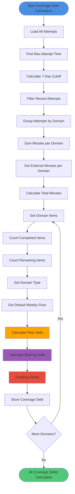

# Coverage Debt Calculation Process Activity Diagram

Complete process for calculating coverage debt scores per domain.



## Process Steps

### 1. Load All Attempts
- **Source**: SQLite database (attempts table)
- **Query**: `SELECT * FROM attempts ORDER BY created_at DESC`
- **Purpose**: Get all attempts for analysis

### 2. Find Max Attempt Time
- **Process**: Find most recent attempt timestamp
- **Calculation**: `maxAttemptTime = max(attempts.map(a => a.created_at))`
- **Purpose**: Reference point for 7-day window

### 3. Calculate 7-Day Cutoff
- **Formula**: `recentCutoff = maxAttemptTime - (7 * 24 * 60 * 60 * 1000)`
- **Purpose**: Define time window for recent activity
- **Window**: Last 7 days from most recent attempt

### 4. Filter Recent Attempts
- **Criteria**: `attempt.created_at >= recentCutoff`
- **Purpose**: Only count activity in last 7 days
- **Output**: Array of recent attempts

### 5. Group by Domain
- **Process**: Group attempts by item domain
- **Mapping**: `attempt.item.domain → attempts[]`
- **Purpose**: Calculate per-domain statistics

### 6. Sum Minutes per Domain
- **Process**: Sum `time_spent_min` for each domain
- **Formula**: `minutesLast7d[domain] = sum(attempts.map(a => a.time_spent_min))`
- **Output**: Minutes per domain (internal)

### 7. Get External Minutes
- **Source**: External attempts (logged separately)
- **Process**: Sum external minutes per domain in last 7 days
- **Output**: `externalMinutesLast7d[domain]`

### 8. Calculate Total Minutes
- **Formula**: `totalMinutes = minutesLast7d + (externalMinutesLast7d * 0.4)`
- **External Weight**: 40% contribution
- **Purpose**: Combine internal and external practice
- **Output**: Total minutes per domain

### 9. Get Domain Items
- **Source**: All items with domain classification
- **Process**: Filter items by domain
- **Output**: Array of items per domain

### 10. Count Completed Items
- **Criteria**: 
  - `item.completed === true` OR
  - `item.id in completedItemIds`
- **Calculation**: `completedUnits = count(completed items)`
- **Output**: Completed count per domain

### 11. Count Remaining Items
- **Calculation**: `remainingUnits = totalItems - completedUnits`
- **Output**: Remaining count per domain

### 12. Get Domain Type
- **Source**: `classifyDomain(domain)`
- **Types**: FUNDAMENTALS, CODING, INTERVIEW, SPICE
- **Purpose**: Determine default weekly floor

### 13. Get Default Weekly Floor
- **Defaults**:
  - Fundamentals: 60 minutes/week
  - Coding: 120 minutes/week
  - Interview: 30 minutes/week
  - Spice: 10 minutes/week
- **Output**: `weeklyFloorMinutes` per domain

### 14. Calculate Floor Debt
- **Formula**: 
  ```
  floorDebt = max(0, weeklyFloorMinutes - totalMinutes) / 
              max(weeklyFloorMinutes, 1)
  ```
- **Range**: 0-1 (0 = no debt, 1 = maximum debt)
- **Meaning**: Percentage of weekly floor not met
- **Protection**: Division by zero protection (max(weeklyFloorMinutes, 1))

### 15. Calculate Backlog Debt
- **Formula**: 
  ```
  backlogDebt = remainingUnits / 
                (remainingUnits + completedUnits + 5)
  ```
- **Range**: 0-1 (approaches 1 as remaining increases)
- **Meaning**: Proportion of incomplete work
- **Smoothing**: +5 prevents division issues

### 16. Combine Debts
- **Formula**: 
  ```
  coverageDebt = 0.6 * floorDebt + 0.4 * backlogDebt
  ```
- **Weights**: 
  - 60% floor debt (time-based)
  - 40% backlog debt (completion-based)
- **Range**: 0-1 (higher = more debt)
- **Invariant**: Formula unchanged, no time-based factors

### 17. Store Coverage Debt
- **Storage**: `domainDebts[domain] = coverageDebt`
- **Usage**: Used for prioritization (review, breadth selection)

## Formula Details

### Floor Debt
```
floorDebt = max(0, weeklyFloorMinutes - totalMinutes) / 
            max(weeklyFloorMinutes, 1)
```

- **Numerator**: Shortfall (weekly floor - total minutes)
- **Denominator**: Weekly floor (for percentage)
- **Range**: 0-1
- **Edge Cases**: Handles zero weekly floor

### Backlog Debt
```
backlogDebt = remainingUnits / (remainingUnits + completedUnits + 5)
```

- **Numerator**: Remaining work
- **Denominator**: Total work + smoothing factor
- **Range**: 0-1
- **Smoothing**: +5 prevents division by zero and provides smoothing

### Coverage Debt
```
coverageDebt = 0.6 * floorDebt + 0.4 * backlogDebt
```

- **Weighted Combination**: 60% time, 40% completion
- **Range**: 0-1
- **Invariant**: Formula never modified

## External Minutes Integration

### Weight Rationale
- **40% Weight**: External attempts are less structured
- **Balance**: Acknowledges external practice without over-weighting
- **Formula**: `totalMinutes = internal + (external * 0.4)`

### Use Case
- Track practice on LeetCode, HackerRank, etc.
- Contribute to coverage without double-counting
- Prevent penalizing users for external practice

## Error Handling

### No Attempts
- **Condition**: No attempts in database
- **Result**: Returns default debt (0.5 if no data)
- **Handling**: Graceful degradation

### No Items
- **Condition**: No items for domain
- **Result**: Returns 0 debt (nothing to cover)
- **Handling**: Prevents division by zero

### Missing Domain Data
- **Condition**: Domain not in domainData
- **Result**: Uses 0 for missing values
- **Handling**: Safe defaults

## Invariants

- ✅ **Formula Unchanged**: Coverage debt formula never modified
- ✅ **No Time Factors**: No dates, cooldowns, or time-based logic
- ✅ **Deterministic**: Same inputs → same debt scores
- ✅ **External Weight**: External attempts contribute 40% max
- ✅ **Domain-Specific**: Each domain calculated independently

