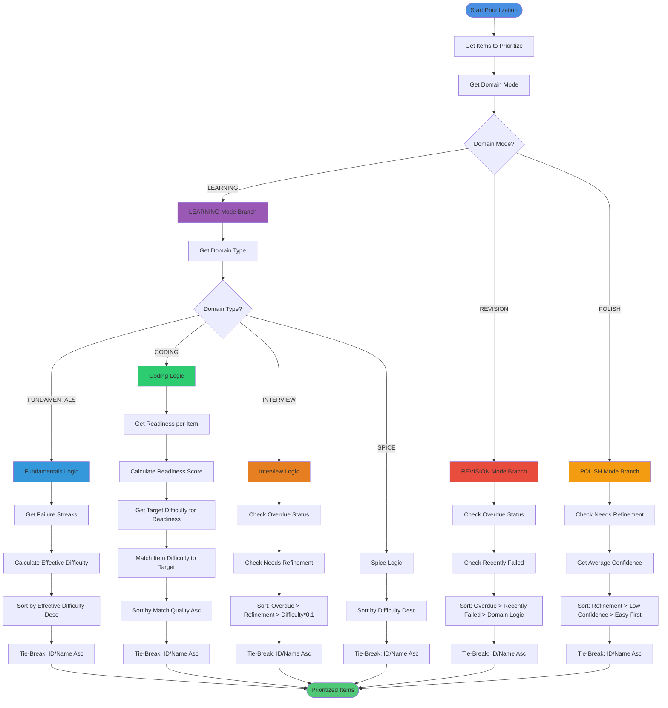

# Difficulty Prioritization Process Activity Diagram

Complete process for prioritizing items by difficulty with domain mode and type branching.



## Process Steps

### 1. Get Domain Mode
- **Source**: `getDefaultDomainMode()` or parameter
- **Modes**: LEARNING (default), REVISION, POLISH
- **Branching**: Mode branches FIRST

### 2. LEARNING Mode - Fundamentals
- **Process**:
  1. Get failure streak per item
  2. Calculate effective difficulty: `baseDifficulty - min(1.5, failureStreak * 0.5)`
  3. Sort by effective difficulty (descending)
  4. Tie-break by ID/name (ascending)
- **Logic**: Hard-first with failure backoff
- **Backoff**: Attempt-based only (no time logic)

### 3. LEARNING Mode - Coding
- **Process**:
  1. Get readiness per item (successRate, avgConfidence, avgTimeToSolve, mistakeRecurrence)
  2. Calculate readiness score: weighted combination
  3. Get target difficulty based on readiness:
     - Readiness < 0.3 → Easy (2)
     - Readiness 0.3-0.7 → Medium (3)
     - Readiness ≥ 0.7 → Hard (4-5)
  4. Match item difficulty to target
  5. Sort by match quality (ascending)
  6. Tie-break by ID/name (ascending)
- **Logic**: Readiness-based difficulty matching
- **Pattern Readiness**: Uses pattern-level if available

### 4. LEARNING Mode - Interview
- **Process**:
  1. Check overdue status (lastAttemptIndex ≥ 15)
  2. Check needs refinement (lastResult Stuck/Skipped or avgConfidence < 0.5)
  3. Sort by:
     - Overdue (100 points)
     - Needs refinement (50 points)
     - Difficulty * 0.1 (weak weighting)
  4. Tie-break by ID/name (ascending)
- **Logic**: Overdue/refinement prioritized, difficulty weakly weighted

### 5. LEARNING Mode - Spice
- **Process**:
  1. Sort by difficulty (descending)
  2. Tie-break by ID/name (ascending)
- **Logic**: Original behavior (low frequency)

### 6. REVISION Mode
- **Process**:
  1. Check overdue status
  2. Check recently failed (lastResult Stuck/Skipped)
  3. Sort by:
     - Overdue (100 points)
     - Recently failed (50 points)
     - Domain-specific secondary sort
  4. Tie-break by ID/name (ascending)
- **Logic**: Prioritizes items needing review

### 7. POLISH Mode
- **Process**:
  1. Check needs refinement
  2. Get average confidence
  3. Sort by:
     - Needs refinement (100 points)
     - Low confidence (ascending)
     - Easier items first (ascending difficulty)
  4. Tie-break by ID/name (ascending)
- **Logic**: Prioritizes refinement and confidence building

## Readiness Calculation

### Metrics
- **Success Rate**: `solved.length / recent.length` (last 10 attempts)
- **Avg Confidence**: Average of confidence values (High=1, Medium=0.5, Low=0)
- **Avg Time**: Average of `time_spent_min` values
- **Mistake Recurrence**: `mistakes.length / recent.length`

### Score Formula
```
readinessScore = (successRate * 0.4) + 
                 (avgConfidence * 0.3) + 
                 (timeFactor * 0.2) + 
                 (mistakeFactor * 0.1)
```

Where:
- `timeFactor = max(0, 1 - (avgTimeToSolve / 60))`
- `mistakeFactor = max(0, 1 - mistakeRecurrence)`

## Effective Difficulty Calculation

### Formula
```
effectiveDifficulty = baseDifficulty - min(1.5, failureStreak * 0.5)
```

### Constraints
- Minimum: 1 (cannot go below)
- Maximum Backoff: 1.5 (failureStreak * 0.5 capped at 1.5)
- Failure Streak: Attempt-based only (no time logic)

## Tie-Breaking

### Deterministic Sort
- **Primary**: Priority-based sorting (varies by mode/type)
- **Secondary**: Item ID or name (ascending)
- **Purpose**: Ensures same inputs → same outputs
- **Applied**: After all priority sorting

## Invariants

- ✅ **Mode First**: Domain mode branches before domain type
- ✅ **Attempt-Based**: Failure backoff uses attempt streak only
- ✅ **Deterministic**: Tie-breaking ensures same outputs
- ✅ **Readiness-Based**: Coding uses readiness, not absolute difficulty
- ✅ **No Time Logic**: No dates, cooldowns, or resurfacing windows

