# Session Composition Process Activity Diagram

Complete process flow for composing a 3-unit session.

```mermaid
flowchart TD
    Start([Start Session Composition]) --> FetchItems[Fetch Items from All Databases]
    FetchItems --> MergeItems[Merge Items Deterministically]
    MergeItems --> FilterUncompleted[Filter Uncompleted Items]
    FilterUncompleted --> LoadAttempts[Load Attempts Data]
    LoadAttempts --> CalculateCoverageDebt[Calculate Coverage Debt per Domain]
    
    CalculateCoverageDebt --> SelectReview[Select Review Unit]
    SelectReview --> ReviewCheck{Review Unit<br/>Found?}
    ReviewCheck -->|Yes| SelectCore[Select Core Unit]
    ReviewCheck -->|No| ReviewFallback[Use Fallback Review]
    ReviewFallback --> SelectCore
    
    SelectCore --> FilterCoreDomain[Filter by Core Domain Type]
    FilterCoreDomain --> GetDomainMode[Get Domain Mode]
    GetDomainMode --> PrioritizeCore[Prioritize Core Candidates]
    PrioritizeCore --> CoreCheck{Core Unit<br/>Found?}
    CoreCheck -->|Yes| SelectBreadth[Select Breadth Unit]
    CoreCheck -->|No| CoreFallback[Use Fallback Core]
    CoreFallback --> SelectBreadth
    
    SelectBreadth --> FilterBreadthDomain[Filter: Different Domain from Core]
    FilterBreadthDomain --> SortByDebt[Sort by Coverage Debt Desc]
    SortByDebt --> BreadthCheck{Breadth Unit<br/>Found?}
    BreadthCheck -->|Yes| ValidateUnits[Validate All 3 Units Exist]
    BreadthCheck -->|No| BreadthFallback[Use Fallback Breadth]
    BreadthFallback --> ValidateUnits
    
    ValidateUnits --> AllUnitsCheck{All 3 Units<br/>Valid?}
    AllUnitsCheck -->|No| Error([Error: Unable to Compose Session])
    AllUnitsCheck -->|Yes| AllocateTime[Allocate Time per Focus Mode]
    
    AllocateTime --> CalculateReviewTime[Calculate Review Time: 5-8 min]
    CalculateReviewTime --> CalculateCoreTime[Calculate Core Time: 20-32 min]
    CalculateCoreTime --> CalculateBreadthTime[Calculate Breadth Time: 5-12 min]
    CalculateBreadthTime --> EnsureTotal[Ensure Total Matches Duration]
    
    EnsureTotal --> CreateUnits[Create Unit Objects]
    CreateUnits --> ComposeSession[Compose Session Object]
    ComposeSession --> End([Session Composed])
    
    style Start fill:#4a90e2
    style End fill:#50c878
    style Error fill:#ff6b6b
    style CalculateCoverageDebt fill:#ffa500
    style PrioritizeCore fill:#9b59b6
```



## Process Steps

### 1. Item Fetching
- **Action**: Fetch items from all databases in parallel
- **Process**: 
  - For each domain → database ID(s)
  - Fetch items via `fetchItemsBySourceDatabase(dbId)`
  - Add domain and sourceDatabaseId metadata
- **Output**: Array of all items with metadata

### 2. Deterministic Merge
- **Action**: Merge items from multiple databases per domain
- **Sort Order**: Item count (desc) > Database ID (asc)
- **Result**: Deterministic item order (same inputs → same outputs)
- **Metadata**: Preserves `sourceDatabaseId` on all items

### 3. Filter Uncompleted
- **Action**: Exclude completed and solved items
- **Criteria**:
  - `item.completed !== true`
  - `item.id not in completedItemIds`
- **Output**: Array of uncompleted items

### 4. Load Attempts Data
- **Action**: Load and process attempts
- **Process**:
  - Fetch all attempts
  - Calculate readiness per item
  - Calculate failure streaks
  - Aggregate domain statistics
- **Output**: Comprehensive attempts context

### 5. Calculate Coverage Debt
- **Action**: Calculate debt per domain
- **Process**:
  - For each domain:
    - Get weekly floor (by domain type)
    - Get minutes done (last 7 days)
    - Get remaining/completed units
    - Calculate: `0.6 * floorDebt + 0.4 * backlogDebt`
- **Output**: Coverage debt score (0-1) per domain

### 6. Select Review Unit
- **Criteria**:
  - Has attempts
  - Last result: Solved or Partial
  - Last attempt index ≤ review window (10)
- **Sort**: Coverage debt (desc) > Attempt index (asc)
- **Fallback**: Any completed item if no recent reviews

### 7. Select Core Unit
- **Filter**: Domain type matches focus mode
  - DSA-Heavy → CODING
  - Interview-Heavy → INTERVIEW
  - Balanced → FUNDAMENTALS
- **Prioritize**: Apply difficulty prioritization
- **Fallback**: Highest coverage debt item if no core candidates

### 8. Select Breadth Unit
- **Filter**: Different domain from core unit
- **Sort**: Coverage debt (descending)
- **Fallback**: Any uncompleted item if no breadth candidates

### 9. Validate Units
- **Check**: All 3 units exist and valid
- **Error**: Throw if unable to compose full session
- **Requirement**: At least 3 items needed

### 10. Allocate Time
- **Focus Mode Time Ranges**:
  - Balanced: Review 5-8, Core 20-32, Breadth 5-12
  - DSA-Heavy: Review 5-8, Core 25-35, Breadth 5-10
  - Interview-Heavy: Review 5-8, Core 18-28, Breadth 8-15
- **Calculation**: Proportional scaling to match total duration
- **Ensure**: Total always equals selected duration (30, 45, or 90)

### 11. Create Unit Objects
- **Structure**:
  ```javascript
  {
    type: 'review' | 'core' | 'breadth',
    unitType: 'SolveProblem' | 'ConceptBite' | ...,
    item: {...},
    rationale: '...',
    timeMinutes: 6,
    completed: false,
    output: null
  }
  ```

### 12. Compose Session
- **Structure**:
  ```javascript
  {
    totalMinutes: 45,
    focusMode: 'balanced',
    units: [reviewUnit, coreUnit, breadthUnit],
    startTime: Date.now(),
    currentUnitIndex: 0,
    viewUnitIndex: 0
  }
  ```

## Decision Points

### Review Unit Found?
- **Yes**: Use selected review unit
- **No**: Use fallback (any completed item)

### Core Unit Found?
- **Yes**: Use selected core unit
- **No**: Use fallback (highest coverage debt)

### Breadth Unit Found?
- **Yes**: Use selected breadth unit
- **No**: Use fallback (any uncompleted item)

### All 3 Units Valid?
- **Yes**: Proceed to time allocation
- **No**: Error - unable to compose session

## Error Handling

### Unable to Compose Session
- **Trigger**: Less than 3 valid units
- **Error Message**: "Unable to compose a full session. Import more items and confirm domains."
- **Action**: User must import more items

### No Items for Domain Type
- **Trigger**: Focus mode requires domain type with no items
- **Fallback**: Uses highest coverage debt item
- **Warning**: Logged but doesn't block composition

## Invariants

- ✅ **Exactly 3 Units**: Session always has Review, Core, Breadth
- ✅ **Deterministic**: Same inputs → same unit selection
- ✅ **Time Allocation**: Total always matches selected duration
- ✅ **Unit Validation**: All units must have valid items
- ✅ **Coverage Debt**: Used for prioritization, not time allocation

