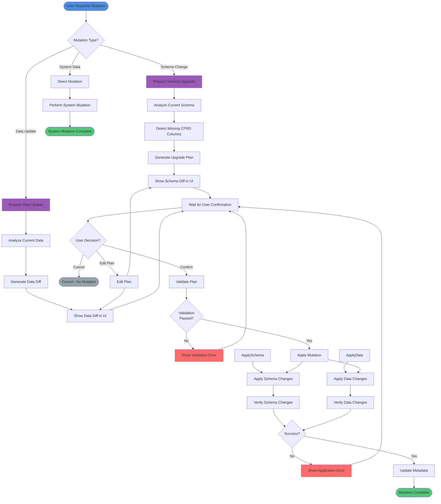

# Zero-Trust Mutation Process Activity Diagram

Complete process for user data mutations following prepare → confirm → apply pattern.

## Process Steps

### 1. Determine Mutation Type
- **Schema Change**: Adding/removing database columns
- **Data Update**: Updating item properties or data
- **System Data**: Attempts, activity records (no confirmation needed)

### 2. Prepare Phase (No Mutation)
- **Schema Upgrade**:
  1. Analyze current schema
  2. Detect missing CPRD columns
  3. Generate upgrade plan with proposed changes
  4. Return plan (no mutation)
- **Data Update**:
  1. Analyze current data
  2. Generate diff showing changes
  3. Return plan (no mutation)

### 3. Show Diff in UI
- **Schema Diff**: Shows added/removed columns
- **Data Diff**: Shows before/after values
- **Impact Explanation**: Explains what will change
- **No Mutation**: Still no changes applied

### 4. Wait for Confirmation
- **UI State**: Shows confirmation dialog
- **Actions Available**:
  - Cancel (no mutation)
  - Edit Plan (modify before applying)
  - Confirm (proceed with mutation)
- **Blocking**: No mutation until explicit confirmation

### 5. Validate Plan
- **Schema Validation**:
  - Check column names valid
  - Check column types valid
  - Check CPRD prefix present
- **Data Validation**:
  - Check data types match
  - Check required fields present
  - Check no conflicts
- **Error Handling**: Show validation errors, block application

### 6. Apply Mutation
- **Schema Application**:
  - Add missing columns via Notion API
  - Update schema metadata
  - Store property IDs
- **Data Application**:
  - Update item properties
  - Update data values
  - Preserve user columns
- **Atomic**: All or nothing (transaction-like)

### 7. Verify Changes
- **Schema Verification**:
  - Confirm columns added
  - Verify property IDs stored
  - Check schema hash updated
- **Data Verification**:
  - Confirm data updated
  - Verify no data loss
  - Check consistency
- **Error Handling**: Rollback if verification fails

### 8. Update Metadata
- **Schema**: Update `confirmed_schema_hash`
- **Data**: Update last modified timestamp
- **Storage**: Persist changes
- **Complete**: Mutation successful

## System Data Mutation (Direct)

### Process
- **No Preparation**: Direct mutation
- **No Confirmation**: No UI confirmation needed
- **Examples**: 
  - Creating attempts
  - Recording activity
  - Updating session state
- **Rationale**: System-owned data, not user-owned

## Zero-Trust Principles

### Never Auto-Apply
- **User Data**: Always requires explicit confirmation
- **No Remembered Consent**: Every mutation requires confirmation
- **No Implicit Approval**: Must click "Apply" button

### Always Show Diffs
- **Schema Changes**: Show added/removed columns
- **Data Changes**: Show before/after values
- **Impact**: Explain what will change
- **Transparency**: User sees exactly what will happen

### Block Until Confirmation
- **UI State**: Disabled until confirmation
- **No Background**: No silent mutations
- **No Trusted Modes**: No "always allow" option
- **Explicit Action**: Must click confirm button

## Error Handling

### Validation Errors
- **Trigger**: Plan validation fails
- **Action**: Show error, block application
- **Recovery**: User can edit plan and retry

### Application Errors
- **Trigger**: Mutation application fails
- **Action**: Show error, allow retry
- **Recovery**: User can retry or cancel

### Verification Errors
- **Trigger**: Verification after application fails
- **Action**: Show error, attempt rollback
- **Recovery**: User can retry or contact support

## Invariants

- ✅ **Prepare First**: Always prepare before applying
- ✅ **Show Diffs**: Always show what will change
- ✅ **Require Confirmation**: Never auto-apply user data
- ✅ **System Data Direct**: System data can be auto-managed
- ✅ **Fail Loudly**: Never silently degrade or fall back

## Examples

### Schema Upgrade Flow
1. User opens upgrade flow
2. System prepares upgrade plan (no mutation)
3. UI shows proposed columns
4. User clicks "Apply Upgrade"
5. System applies schema changes
6. System verifies changes
7. Update confirmed_schema_hash

### Data Update Flow
1. User requests data update
2. System prepares update plan (no mutation)
3. UI shows data diff
4. User clicks "Apply Update"
5. System applies data changes
6. System verifies changes
7. Update complete

