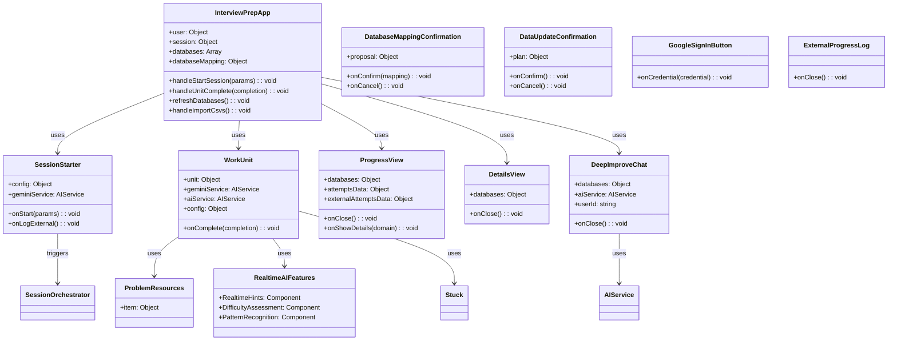

# Components Layer Class Diagram

React UI components following UX contract and zero-trust patterns.

## Component Details

### InterviewPrepApp (`src/InterviewPrepApp.jsx`)
- **Purpose**: Main application component
- **State Management**:
  - Uses `useSession`, `useAuth`, `useProfile`, `useAttempts`, `useExternalAttempts`
  - Manages `databases`, `databaseMapping`, `error` state
- **Key Methods**:
  - `handleStartSession(params)` - Orchestrates and starts session
  - `handleUnitComplete(completion)` - Handles unit completion and attempt recording
  - `refreshDatabases()` - Refreshes database list
  - `handleImportCsvs()` - Imports CSV files
- **Views**: SessionStarter (default), WorkUnit (active session), Settings, Progress, Details, DeepImprove
- **UX Contract**: Default entry = Start Session (no dashboard)

### SessionStarter (`src/components/SessionStarter.jsx`)
- **Purpose**: Session configuration and start UI
- **Props**:
  - `onStart(params)` - Callback with session parameters
  - `config` - Configuration object (isConfigured, hasData)
  - `geminiService` - AI service for mood mode
  - `onLogExternal()` - Opens external progress log
- **Features**:
  - Duration selection (30, 45, 90 minutes)
  - Focus mode selection (Balanced, DSA-Heavy, Interview-Heavy, Custom, Mood)
  - Mood mode with custom prompt and question count (5 or 10)
- **UX Contract**: Max 3 items in lists

### WorkUnit (`src/components/WorkUnit.jsx`)
- **Purpose**: Work unit display with stuck mode
- **Props**:
  - `unit` - Unit object (item, unitType, rationale, timeMinutes)
  - `onComplete(completion)` - Completion callback
  - `geminiService`, `aiService` - AI services
  - `config` - Configuration
- **Features**:
  - Unit content display (problem, concept, etc.)
  - Output textarea (required for completion)
  - Stuck mode actions (Nudge, Checkpoint, Rescue)
  - Problem resources integration
  - Real-time AI features (hints, difficulty assessment, pattern recognition)
- **Stuck Actions**: All unit types support all actions
- **Rescue**: Requires recap (user must explain solution back)

### ProgressView (`src/components/ProgressView.jsx`)
- **Purpose**: Progress visualization and statistics
- **Props**:
  - `databases` - Database mapping
  - `attemptsData` - Attempts data from `getAttemptsData()`
  - `externalAttemptsData` - External attempts data
  - `onClose()` - Close callback
  - `onShowDetails(domain)` - Show domain details callback
- **Features**:
  - Domain progress overview
  - Coverage debt visualization
  - External progress logging
  - Domain detail navigation

### DetailsView (`src/components/DetailsView.jsx`)
- **Purpose**: Detailed domain statistics
- **Props**:
  - `databases` - Database mapping
  - `onClose()` - Close callback
- **Features**:
  - Item-level statistics
  - Attempt history
  - Pattern-level analysis (for coding domains)

### DeepImproveChat (`src/components/DeepImproveChat.jsx`)
- **Purpose**: AI-powered domain data quality analysis
- **Props**:
  - `databases` - Database mapping
  - `onClose()` - Close callback
  - `aiService` - AI service
  - `userId` - User ID
- **Features**:
  - Chat interface for domain analysis
  - Data quality suggestions
  - Improvement recommendations

### DatabaseMappingConfirmation (`src/components/DatabaseMappingConfirmation.jsx`)
- **Purpose**: Database discovery confirmation UI
- **Props**:
  - `proposal` - Discovery proposal with confidence scores
  - `onConfirm(mapping)` - Confirmation callback
  - `onCancel()` - Cancel callback
- **Features**:
  - Shows domain → database mappings
  - Displays confidence scores
  - Warns on low confidence (0.4-0.7)
  - Blocks on very low confidence (<0.4)
- **Zero-Trust**: Never auto-applies without confirmation

### DataUpdateConfirmation (`src/components/DataUpdateConfirmation.jsx`)
- **Purpose**: Data update confirmation UI
- **Props**:
  - `plan` - Update plan with diffs
  - `onConfirm()` - Confirmation callback
  - `onCancel()` - Cancel callback
- **Features**:
  - Shows data diffs
  - Impact explanation
  - Requires explicit confirmation
- **Zero-Trust**: Prepare → Show → Confirm → Apply pattern

### ProblemResources (`src/components/ProblemResources.jsx`)
- **Purpose**: Problem resource display
- **Props**:
  - `item` - Problem item
- **Features**:
  - Web search results
  - Documentation links
  - Tutorial suggestions

### RealtimeAIFeatures (`src/components/RealtimeAIFeatures.jsx`)
- **Purpose**: Real-time AI assistance features
- **Components**:
  - `RealtimeHints` - Context-aware hints
  - `DifficultyAssessment` - Difficulty analysis
  - `PatternRecognition` - Pattern identification
- **Use Case**: Integrated into WorkUnit for enhanced learning

### GoogleSignInButton (`src/components/GoogleSignInButton.jsx`)
- **Purpose**: Google OAuth sign-in
- **Props**:
  - `onCredential(credential)` - Credential callback
- **Features**:
  - Google OAuth integration
  - Token exchange with backend

### ExternalProgressLog (`src/components/ExternalProgressLog.jsx`)
- **Purpose**: Log external practice attempts
- **Props**:
  - `onClose()` - Close callback
- **Features**:
  - Log attempts from external platforms (LeetCode, etc.)
  - Domain and time tracking
  - Contributes to coverage debt (40% weight)

## Relationships

- **InterviewPrepApp** orchestrates all components and manages global state
- **SessionStarter** triggers **SessionOrchestrator** via `handleStartSession`
- **WorkUnit** uses **Stuck**, **ProblemResources**, and **RealtimeAIFeatures**
- **DatabaseMappingConfirmation** and **DataUpdateConfirmation** enforce zero-trust patterns
- All components follow **UX contract** (default Start Session, max 3 items in lists)

## UX Contract Compliance

- ✅ Default entry screen: **Start Session** (no dashboard)
- ✅ No lists longer than three items
- ✅ Each unit displays one-line rationale
- ✅ Swap action shows at most two alternatives (if implemented)
- ✅ Simple, focused interface

## Zero-Trust Pattern

- **DatabaseMappingConfirmation**: Shows proposal, requires confirmation
- **DataUpdateConfirmation**: Shows diffs, requires confirmation
- **Never auto-applies** user data mutations

