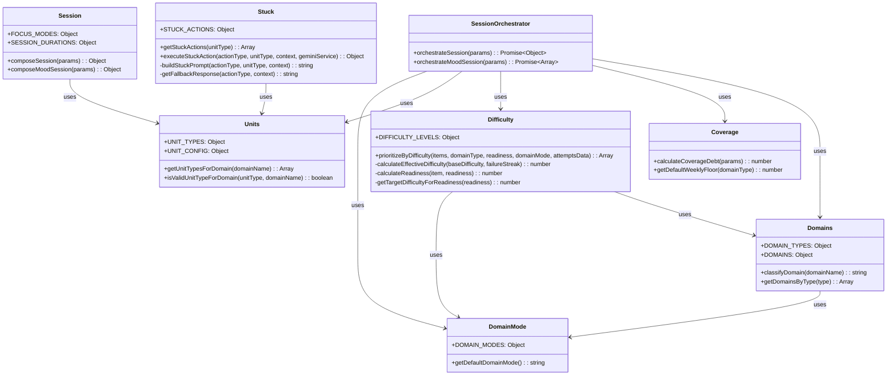

# Core Layer Class Diagram

Core business logic modules with pure functions and no external dependencies.

## Module Details

### Domains (`src/core/domains.js`)
- **Purpose**: Domain classification and type definitions
- **Key Functions**:
  - `classifyDomain()` - Maps domain name to domain type (FUNDAMENTALS, CODING, INTERVIEW, SPICE)
  - `getDomainsByType()` - Returns all domains of a specific type
- **Domain Types**: FUNDAMENTALS, CODING, INTERVIEW, SPICE
- **Domains**: DSA, OOP, OS, DBMS, CN, Behavioral, HR, OA, Phone Screen, Aptitude, Puzzles, LLD, HLD

### DomainMode (`src/core/domainMode.js`)
- **Purpose**: Domain mode system (LEARNING, REVISION, POLISH)
- **Key Functions**:
  - `getDefaultDomainMode()` - Returns default mode (LEARNING)
- **Modes**: LEARNING, REVISION, POLISH

### Coverage (`src/core/coverage.js`)
- **Purpose**: Coverage debt calculation model
- **Key Functions**:
  - `calculateCoverageDebt()` - Computes debt score (0-1) using formula: `0.6 * floorDebt + 0.4 * backlogDebt`
  - `getDefaultWeeklyFloor()` - Returns default weekly minutes by domain type
- **Formula**: `floorDebt = max(0, weeklyFloorMinutes - minutesDoneLast7d) / weeklyFloorMinutes`, `backlogDebt = remainingUnits / (remainingUnits + completedUnits + 5)`

### Session (`src/core/session.js`)
- **Purpose**: Session composition (exactly 3 units)
- **Key Functions**:
  - `composeSession()` - Creates timed session with Review, Core, Breadth units
  - `composeMoodSession()` - Creates untimed mood mode session
- **Focus Modes**: BALANCED, DSA_HEAVY, INTERVIEW_HEAVY, CUSTOM, MOOD
- **Durations**: SHORT (30), DEFAULT (45), LONG (90) minutes
- **Invariant**: Always exactly 3 units per session

### Units (`src/core/units.js`)
- **Purpose**: Work unit type definitions and validation
- **Key Functions**:
  - `getUnitTypesForDomain()` - Returns applicable unit types for a domain
  - `isValidUnitTypeForDomain()` - Validates unit type for domain
- **Unit Types**: SOLVE_PROBLEM, CONCEPT_BITE, RECALL_CHECK, EXPLAIN_OUT_LOUD, STORY_DRAFT, MOCK_QA
- **All units require output** (`requiresOutput: true`)

### Difficulty (`src/core/difficulty.js`)
- **Purpose**: Difficulty-based prioritization by domain type and mode
- **Key Functions**:
  - `prioritizeByDifficulty()` - Sorts items based on domain mode → domain type → difficulty logic
- **Prioritization Logic**:
  - **LEARNING mode**: Fundamentals (hard-first), Coding (readiness-based), Interview (overdue/refinement-first)
  - **REVISION mode**: Overdue and recently failed items prioritized
  - **POLISH mode**: Needs refinement and low confidence prioritized
- **Failure Backoff**: Attempt-based only (no time logic)

### Stuck (`src/core/stuck.js`)
- **Purpose**: Stuck mode actions and prompts
- **Key Functions**:
  - `getStuckActions()` - Returns available actions for unit type
  - `executeStuckAction()` - Executes stuck action with AI service
- **Actions**: NUDGE, CHECKPOINT, RESCUE (requires recap)
- **All actions available for all unit types**

### SessionOrchestrator (`src/core/sessionOrchestrator.js`)
- **Purpose**: Orchestrates daily sessions
- **Key Functions**:
  - `orchestrateSession()` - Composes 3-unit timed session
  - `orchestrateMoodSession()` - Composes untimed mood session with custom prompt
- **Process**:
  1. Fetch items from all databases
  2. Calculate coverage debt per domain
  3. Select Review unit (recently completed, attempt-order based)
  4. Select Core unit (based on focus mode and domain type)
  5. Select Breadth unit (highest coverage debt, different domain)
- **Deterministic**: Same inputs → same outputs

## Relationships

- **SessionOrchestrator** orchestrates the entire session composition process
- **Difficulty** uses **Domains** and **DomainMode** for prioritization logic
- **Session** uses **Units** to validate unit types
- **Stuck** uses **Units** to get unit-specific actions
- All modules are **pure functions** with no side effects

