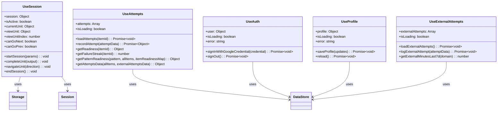

# Hooks Layer Class Diagram

React hooks for state management and data fetching.

## Hook Details

### UseSession (`src/hooks/useSession.js`)
- **Purpose**: Session state and lifecycle management
- **State**:
  - `session` - Current session object with units
  - `isActive` - Whether a session is currently active
  - `currentUnit` - Unit currently being edited (for completion)
  - `viewUnit` - Unit currently being viewed (for navigation)
  - `viewUnitIndex` - Index of viewed unit
- **Methods**:
  - `startSession(params)` - Starts new session (timed or mood mode)
  - `completeUnit(output)` - Marks current unit as complete and moves to next
  - `navigateUnit(direction)` - Navigates between units (view-only)
  - `endSession()` - Ends current session and clears storage
- **Storage**: Persists session to `chrome.storage.local`
- **Invariant**: Exactly 3 units per session (timed mode)

### UseAttempts (`src/hooks/useAttempts.js`)
- **Purpose**: Attempt tracking and readiness calculation
- **State**:
  - `attempts` - Array of all attempts
  - `isLoading` - Loading state
- **Methods**:
  - `loadAttempts(itemId)` - Loads attempts (all or for specific item)
  - `recordAttempt(attemptData)` - Creates new attempt (system-owned, no confirmation)
  - `getReadiness(itemId)` - Calculates readiness metrics (successRate, avgConfidence, avgTimeToSolve, mistakeRecurrence)
  - `getFailureStreak(itemId)` - Calculates attempt-based failure streak (resets on Solved/Partial)
  - `getPatternReadiness(pattern, allItems, itemReadinessMap)` - Aggregates readiness by pattern (for coding domains)
  - `getAttemptsData(allItems, externalAttemptsData)` - Returns comprehensive attempts data for orchestration
- **Readiness Metrics**:
  - `successRate` - Recent success rate (0-1)
  - `avgConfidence` - Average confidence (0-1)
  - `avgTimeToSolve` - Average time in minutes
  - `mistakeRecurrence` - Mistake frequency (0-1)
- **Failure Streak**: Attempt-based only (no time logic), resets on Solved/Partial

### UseAuth (`src/hooks/useAuth.js`)
- **Purpose**: Authentication state management
- **State**:
  - `user` - Authenticated user object
  - `isLoading` - Loading state
  - `error` - Error message
- **Methods**:
  - `signInWithGoogleCredential(credential)` - Signs in with Google OAuth
  - `signOut()` - Signs out and clears session
- **Authentication**: Google OAuth via backend server

### UseProfile (`src/hooks/useProfile.js`)
- **Purpose**: User profile management
- **State**:
  - `profile` - User profile object (gemini_key, ai_provider, ollama_url, ollama_model, is_allowed)
  - `isLoading` - Loading state
  - `error` - Error message
- **Methods**:
  - `saveProfile(updates)` - Saves profile updates
  - `reload()` - Reloads profile from server
- **Profile Fields**: API keys, AI provider settings, access control

### UseExternalAttempts (`src/hooks/useExternalAttempts.js`)
- **Purpose**: External attempt tracking (outside platform)
- **State**:
  - `externalAttempts` - Array of external attempts
  - `isLoading` - Loading state
- **Methods**:
  - `loadExternalAttempts()` - Loads external attempts
  - `logExternalAttempt(attemptData)` - Logs external attempt
  - `getExternalMinutesLast7d(domain)` - Gets external minutes for domain in last 7 days
- **Use Case**: Track practice done outside the platform (LeetCode, etc.)
- **Coverage Debt**: External attempts contribute 40% weight to coverage calculation

## Relationships

- **UseSession** uses **Storage** for persistence and **Session** for composition
- **UseAttempts** uses **DataStore** for API calls
- **UseAuth**, **UseProfile**, **UseExternalAttempts** use **DataStore** for backend communication
- All hooks follow React patterns (useState, useEffect, useCallback)
- **System-owned data** (attempts) can be auto-managed without confirmation

## State Management Patterns

- **Session State**: Managed in `useSession`, persisted to storage
- **Attempt State**: Managed in `useAttempts`, synced with backend
- **Auth State**: Managed in `useAuth`, persisted via token
- **Profile State**: Managed in `useProfile`, synced with backend
- **External Attempts**: Managed in `useExternalAttempts`, separate from internal attempts

## Data Flow

1. **Session Start**: `useSession.startSession()` → `composeSession()` → Save to storage
2. **Unit Completion**: `useSession.completeUnit()` → `useAttempts.recordAttempt()` → Update session
3. **Readiness Calculation**: `useAttempts.getReadiness()` → Used by `difficulty.prioritizeByDifficulty()`
4. **Attempts Data**: `useAttempts.getAttemptsData()` → Used by `sessionOrchestrator.orchestrateSession()`

