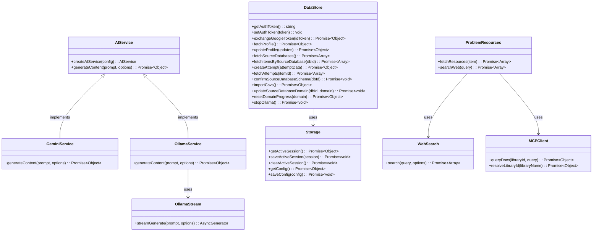

# Services Layer Class Diagram

External integrations with error handling and zero-trust patterns.

## Module Details

### DataStore (`src/services/dataStore.js`)
- **Purpose**: Local API data store (Express server with SQLite)
- **Key Functions**:
  - `fetchSourceDatabases()` - Gets all source databases from local DB
  - `fetchItemsBySourceDatabase(dbId)` - Gets items for a database
  - `createAttempt(attemptData)` - Records attempt (system-owned, no confirmation)
  - `fetchAttempts(itemId)` - Gets attempts for item or all attempts
  - `confirmSourceDatabaseSchema(dbId)` - Confirms schema changes
  - `importCsvs()` - Imports CSV files from data/ directory
  - `updateSourceDatabaseDomain(dbId, domain)` - Updates domain mapping
  - `resetDomainProgress(domain)` - Resets completion status for domain
  - `stopOllama()` - Stops all Ollama models
- **API Base**: `http://localhost:3001` (configurable via `VITE_API_URL`)
- **Authentication**: Bearer token stored in localStorage

### AIService (`src/services/aiService.js`)
- **Purpose**: AI service factory and abstraction
- **Key Functions**:
  - `createAIService(config)` - Creates AI service instance (Gemini or Ollama)
- **Providers**: `gemini`, `ollama`
- **Interface**: `generateContent(prompt, options)`

### GeminiService (`src/services/gemini.js`)
- **Purpose**: Google Gemini AI integration
- **Key Functions**:
  - `generateContent(prompt, options)` - Generates content via Gemini API
- **Configuration**: Requires `geminiKey` (API key)
- **Error Handling**: Rate limit detection and fallback

### OllamaService (`src/services/ollama.js`)
- **Purpose**: Local Ollama AI integration
- **Key Functions**:
  - `generateContent(prompt, options)` - Generates content via Ollama API
- **Configuration**: Requires `ollamaUrl` (default: `http://localhost:11434`) and `ollamaModel`
- **Streaming**: Uses `OllamaStream` for streaming responses

### OllamaStream (`src/services/ollamaStream.js`)
- **Purpose**: Streaming Ollama responses
- **Key Functions**:
  - `streamGenerate(prompt, options)` - Async generator for streaming tokens
- **Use Case**: Real-time AI responses in chat interfaces

### Storage (`src/services/storage.js`)
- **Purpose**: Chrome storage wrapper with type safety
- **Key Functions**:
  - `getActiveSession()` - Retrieves active session from storage
  - `saveActiveSession(session)` - Saves session to storage
  - `clearActiveSession()` - Removes session from storage
  - `getConfig()` - Gets user configuration
  - `saveConfig(config)` - Saves user configuration
- **Storage Type**: `chrome.storage.local` (Chrome extension API)

### ProblemResources (`src/services/problemResources.js`)
- **Purpose**: Problem resource fetching (web search, documentation)
- **Key Functions**:
  - `fetchResources(item)` - Fetches relevant resources for a problem
- **Integrations**: Uses `WebSearch` and `MCPClient` for resource discovery

### WebSearch (`src/services/webSearch.js`)
- **Purpose**: Web search integration
- **Key Functions**:
  - `search(query, options)` - Performs web search
- **Use Case**: Finding external resources, tutorials, solutions

### MCPClient (`src/services/mcpClient.js`)
- **Purpose**: Model Context Protocol client for documentation
- **Key Functions**:
  - `queryDocs(libraryId, query)` - Queries library documentation
  - `resolveLibraryId(libraryName)` - Resolves library name to ID
- **Use Case**: Fetching up-to-date library documentation

## Relationships

- **AIService** is an abstraction implemented by **GeminiService** and **OllamaService**
- **OllamaService** uses **OllamaStream** for streaming responses
- **ProblemResources** aggregates **WebSearch** and **MCPClient** for resource discovery
- **DataStore** uses **Storage** for local data persistence
- All services follow **zero-trust patterns** for user data mutations

## Zero-Trust Pattern

All user data mutations follow the pattern:
1. **Prepare** functions return plans/diffs (no mutation)
2. **Apply** functions require explicit UI confirmation
3. **System-owned data** (attempts) can be auto-managed

## Error Handling

- All services include error handling and recovery
- Rate limit detection with fallback responses
- Fail loudly on validation errors
- Never silently degrade or fall back

