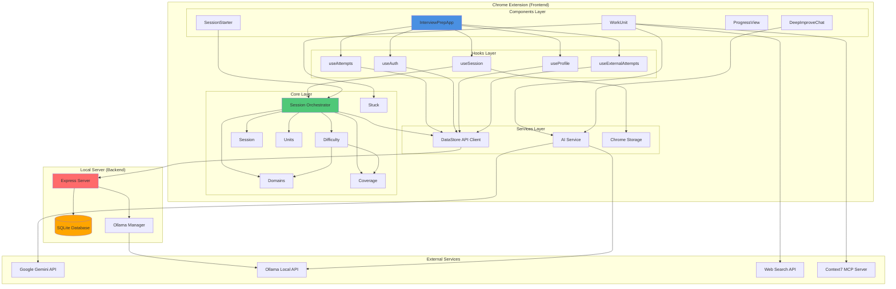

# System Architecture Component Diagram

High-level system architecture showing layer separation, external integrations, and data flow.

## Layer Architecture

### Components Layer
- **Purpose**: UI components and user interactions
- **Files**: `src/components/*.jsx`, `src/InterviewPrepApp.jsx`
- **Responsibilities**:
  - Render UI
  - Handle user interactions
  - Trigger business logic
  - Display data
- **Dependencies**: Hooks Layer, Services Layer

### Hooks Layer
- **Purpose**: React state management and data fetching
- **Files**: `src/hooks/*.js`
- **Responsibilities**:
  - Manage component state
  - Fetch data from services
  - Persist state to storage
  - Coordinate between components and services
- **Dependencies**: Services Layer, Core Layer

### Services Layer
- **Purpose**: External integrations and data persistence
- **Files**: `src/services/*.js`
- **Responsibilities**:
  - API communication
  - Data storage
  - External service integration
  - Error handling
- **Dependencies**: Core Layer (for business logic), External Services

### Core Layer
- **Purpose**: Pure business logic
- **Files**: `src/core/*.js`
- **Responsibilities**:
  - Domain classification
  - Coverage debt calculation
  - Session composition
  - Difficulty prioritization
  - Stuck mode logic
- **Dependencies**: None (pure functions)

## Data Flow

### Session Start Flow
1. **User** clicks "Start Session" in `SessionStarter`
2. **InterviewPrepApp** calls `handleStartSession()`
3. **SessionOrchestrator** fetches items via `DataStore`
4. **SessionOrchestrator** calculates coverage debt via `Coverage`
5. **SessionOrchestrator** prioritizes items via `Difficulty`
6. **SessionOrchestrator** composes session via `Session`
7. **UseSession** saves session to `Storage`
8. **WorkUnit** displays first unit

### Unit Completion Flow
1. **User** completes unit in `WorkUnit`
2. **UseSession** calls `completeUnit()`
3. **UseAttempts** calls `recordAttempt()` via `DataStore`
4. **DataStore** sends to `ExpressServer`
5. **ExpressServer** saves to `SQLiteDB`
6. **UseSession** moves to next unit

### Stuck Mode Flow
1. **User** clicks "I'm Stuck" in `WorkUnit`
2. **WorkUnit** calls `executeStuckAction()` from `Stuck`
3. **Stuck** calls `AIService.generateContent()`
4. **AIService** routes to `GeminiAPI` or `OllamaAPI`
5. **Response** displayed in `WorkUnit`

## External Integrations

### Google Gemini API
- **Purpose**: Cloud AI service for content generation
- **Use Cases**: Stuck mode responses, mood session question selection, DeepImprove analysis
- **Configuration**: API key stored in user profile

### Ollama Local API
- **Purpose**: Local AI service (free, unlimited)
- **Use Cases**: Same as Gemini, but runs locally
- **Configuration**: URL (default: `http://localhost:11434`) and model name

### Web Search API
- **Purpose**: External resource discovery
- **Use Cases**: Problem resources, tutorials, solutions
- **Integration**: Via `WebSearch` service

### Context7 MCP Server
- **Purpose**: Library documentation queries
- **Use Cases**: Code examples, API documentation
- **Integration**: Via `MCPClient` service

## Backend Architecture

### Express Server
- **Purpose**: Local API server
- **Port**: 3001 (configurable)
- **Endpoints**:
  - `/auth/google` - Google OAuth token exchange
  - `/me` - Profile management
  - `/databases` - Source database management
  - `/items` - Item fetching
  - `/attempts` - Attempt CRUD
  - `/ollama/stop` - Ollama control

### SQLite Database
- **Purpose**: Local data persistence
- **Location**: `server/data/app.db`
- **Tables**:
  - `users` - User profiles
  - `source_databases` - Database metadata
  - `items` - Learning items
  - `attempts` - Attempt records
  - `external_attempts` - External practice records

### Ollama Manager
- **Purpose**: Ollama process management
- **Features**: Model stopping, connection checking
- **Integration**: Direct API calls to Ollama

## Security & Data Ownership

### Zero-Trust Pattern
- **User Data**: All mutations require explicit confirmation
- **System Data**: Attempts and activity auto-managed
- **Pattern**: Prepare → Show → Confirm → Apply

### Authentication
- **Method**: Google OAuth
- **Flow**: Frontend → Backend token exchange → JWT storage
- **Storage**: Token in localStorage, user in React state

### Data Persistence
- **Session State**: Chrome storage (local)
- **User Data**: SQLite database (backend)
- **Profile**: SQLite database (backend)
- **Attempts**: SQLite database (backend)

## Invariants

- ✅ **Core Layer**: Pure functions, no side effects
- ✅ **Session Composition**: Exactly 3 units per session
- ✅ **Zero-Trust**: Never auto-apply user data mutations
- ✅ **Deterministic**: Same inputs → same outputs
- ✅ **Coverage Debt**: Formula unchanged, no time-based factors

