# Session Orchestration Component Diagram

Detailed view of session orchestration process, database discovery, and item aggregation.

```mermaid
graph TB
    subgraph "Session Orchestration"
        SessionOrchestrator[Session Orchestrator]
        OrchestrateSession[orchestrateSession]
        OrchestrateMoodSession[orchestrateMoodSession]
    end
    
    subgraph "Database Layer"
        DatabaseMapping[Database Mapping]
        FetchItems[fetchItemsBySourceDatabase]
        MultipleDBs[Multiple DBs per Domain]
        DeterministicMerge[Deterministic Merge Order]
    end
    
    subgraph "Coverage Calculation"
        CoverageDebt[calculateCoverageDebt]
        WeeklyFloor[getDefaultWeeklyFloor]
        DomainData[Domain Data Aggregation]
    end
    
    subgraph "Item Selection"
        ReviewSelection[Review Unit Selection]
        CoreSelection[Core Unit Selection]
        BreadthSelection[Breadth Unit Selection]
    end
    
    subgraph "Prioritization"
        DifficultyPrioritization[prioritizeByDifficulty]
        DomainMode[Domain Mode Branching]
        DomainType[Domain Type Classification]
        ReadinessCalculation[Readiness Calculation]
    end
    
    subgraph "Session Composition"
        ComposeSession[composeSession]
        ComposeMoodSession[composeMoodSession]
        TimeAllocation[Time Allocation]
        UnitValidation[Unit Validation]
    end
    
    subgraph "Attempts Data"
        GetAttemptsData[getAttemptsData]
        ItemAttempts[Item Attempts]
        PatternReadiness[Pattern Readiness]
        FailureStreaks[Failure Streaks]
    end
    
    SessionOrchestrator --> OrchestrateSession
    SessionOrchestrator --> OrchestrateMoodSession
    
    OrchestrateSession --> DatabaseMapping
    OrchestrateSession --> FetchItems
    OrchestrateSession --> CoverageDebt
    OrchestrateSession --> ReviewSelection
    OrchestrateSession --> CoreSelection
    OrchestrateSession --> BreadthSelection
    OrchestrateSession --> ComposeSession
    
    OrchestrateMoodSession --> DatabaseMapping
    OrchestrateMoodSession --> FetchItems
    OrchestrateMoodSession --> AIService
    
    DatabaseMapping --> MultipleDBs
    MultipleDBs --> DeterministicMerge
    
    CoverageDebt --> WeeklyFloor
    CoverageDebt --> DomainData
    CoverageDebt --> GetAttemptsData
    
    CoreSelection --> DifficultyPrioritization
    CoreSelection --> DomainMode
    CoreSelection --> DomainType
    CoreSelection --> ReadinessCalculation
    
    DifficultyPrioritization --> DomainMode
    DifficultyPrioritization --> DomainType
    DifficultyPrioritization --> ReadinessCalculation
    DifficultyPrioritization --> FailureStreaks
    
    ReadinessCalculation --> ItemAttempts
    ReadinessCalculation --> PatternReadiness
    
    ComposeSession --> TimeAllocation
    ComposeSession --> UnitValidation
    
    style SessionOrchestrator fill:#50c878
    style CoverageDebt fill:#4a90e2
    style DifficultyPrioritization fill:#ff6b6b
    style ComposeSession fill:#ffa500
```

## Orchestration Process

### 1. Database Discovery & Mapping
- **Input**: Domain → Database ID(s) mapping
- **Process**:
  - Supports multiple databases per domain (arrays)
  - Deterministic merge order: item count (desc) > database ID (asc)
  - Preserves `sourceDatabaseId` metadata on items
- **Output**: Unified item list with domain and source metadata

### 2. Item Fetching
- **Process**:
  - Fetches items from all databases in parallel
  - Filters uncompleted items (excludes completed and solved items)
  - Normalizes item IDs (handles id, _id, itemId, item_id)
- **Output**: Array of uncompleted items with domain classification

### 3. Coverage Debt Calculation
- **Input**: Domain data (weekly floor, minutes done, remaining/completed units)
- **Process**:
  - Calculates `floorDebt = max(0, weeklyFloorMinutes - minutesDoneLast7d) / weeklyFloorMinutes`
  - Calculates `backlogDebt = remainingUnits / (remainingUnits + completedUnits + 5)`
  - Combines: `coverageDebt = 0.6 * floorDebt + 0.4 * backlogDebt`
  - Includes external attempts (40% weight)
- **Output**: Coverage debt score (0-1) per domain

### 4. Review Unit Selection
- **Criteria**:
  - Recently completed items (lastResult: Solved/Partial)
  - Within review window (lastAttemptIndex ≤ 10)
  - Prioritized by coverage debt, then attempt index
- **Fallback**: Any completed item if no recent reviews
- **Output**: Review unit or null

### 5. Core Unit Selection
- **Criteria**:
  - Based on focus mode → domain type mapping
  - DSA-Heavy → CODING
  - Interview-Heavy → INTERVIEW
  - Balanced → FUNDAMENTALS
- **Process**:
  - Filters items by domain type
  - Applies difficulty prioritization (domain mode → domain type → difficulty logic)
  - Uses readiness data for coding domains
- **Output**: Core unit

### 6. Breadth Unit Selection
- **Criteria**:
  - Different domain from core unit
  - Highest coverage debt
  - Uncompleted items
- **Process**:
  - Sorts by coverage debt (descending)
  - Excludes core unit domain
  - Ensures domain diversity
- **Output**: Breadth unit

### 7. Session Composition
- **Process**:
  - Validates all 3 units exist
  - Allocates time based on focus mode
  - Ensures exact total duration
  - Creates unit objects with metadata
- **Output**: Session object with exactly 3 units

## Mood Mode Orchestration

### Process
1. **Fetch Items**: Same as regular orchestration
2. **Filter Uncompleted**: Excludes completed items
3. **AI Selection**: Uses AI service to select questions based on custom prompt
4. **Keyword Matching**: Fallback keyword-based selection if AI fails
5. **Create Units**: Creates N units (5 or 10) from selected items
6. **Compose**: Creates untimed mood session

### AI Selection
- **Input**: Custom prompt, available items, question count
- **Process**:
  - Prioritizes items matching prompt keywords (pattern, domain, difficulty)
  - Builds rich context about available items
  - Sends selection prompt to AI service
  - Parses JSON response with selected question numbers
- **Output**: Selected items array

## Prioritization Logic

### Domain Mode Branching (First)
1. **LEARNING Mode**:
   - Fundamentals: Hard-first with failure backoff
   - Coding: Readiness-based difficulty matching
   - Interview: Overdue/refinement prioritized
   - Spice: Original behavior

2. **REVISION Mode**:
   - Overdue items prioritized (100 points)
   - Recently failed items prioritized (50 points)
   - Secondary sort by domain-specific logic

3. **POLISH Mode**:
   - Needs refinement prioritized (100 points)
   - Low confidence prioritized (ascending)
   - Easier items prioritized

### Domain Type Branching (Second)
- **FUNDAMENTALS**: Hard-first, downshift on failure
- **CODING**: Readiness-based, pattern-level readiness support
- **INTERVIEW**: Overdue/refinement, weak difficulty weighting
- **SPICE**: Low frequency, optional

## Deterministic Behavior

### Merge Order
- **Sort Criteria**: Item count (desc) > Database ID (asc)
- **Result**: Same databases → same item order
- **Metadata**: `sourceDatabaseId` preserved on all items

### Selection Determinism
- **Tie-Breaking**: Item ID (ascending) or name (ascending)
- **Result**: Same inputs → same unit selection
- **No Randomness**: All selections are deterministic

## Attempts Data Integration

### Data Structure
- **itemData**: Per-item metadata (failureStreak, recentlyFailed, lastResult, etc.)
- **itemReadinessMap**: Readiness metrics per item
- **domainData**: Domain-level statistics (minutesLast7d, externalMinutesLast7d)
- **completedItemIds**: Set of solved item IDs
- **getPatternReadiness**: Pattern-level readiness for coding domains

### Usage
- **Review Selection**: Uses `lastAttemptIndex` and `lastResult`
- **Core Selection**: Uses `readiness` for coding domains, `failureStreak` for fundamentals
- **Coverage Debt**: Uses `domainData` for minutes calculation
- **Completion Filtering**: Uses `completedItemIds` to exclude solved items

## Invariants

- ✅ **Exactly 3 Units**: Session always has Review, Core, Breadth
- ✅ **Deterministic**: Same inputs → same outputs
- ✅ **Coverage Debt Formula**: Unchanged, no time-based factors
- ✅ **Domain Mode First**: Mode branches before type
- ✅ **Failure Backoff**: Attempt-based only, no time logic
- ✅ **Multi-Database**: Supports multiple DBs per domain with deterministic merge

