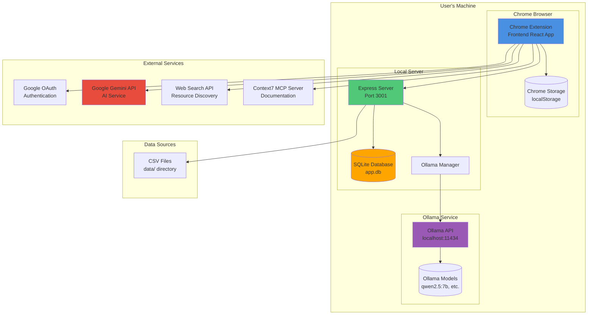

# System Deployment Diagram

Deployment architecture showing Chrome extension, local server, database, and external services.

## Deployment Components

### Chrome Extension (Frontend)
- **Technology**: React + Vite
- **Location**: Browser extension
- **Storage**: Chrome storage.local API
- **Communication**: HTTP requests to local server
- **Features**:
  - Session management
  - Unit display and interaction
  - Progress visualization
  - Settings management
  - AI service integration

### Express Server (Backend)
- **Technology**: Node.js + Express
- **Port**: 3001 (configurable via `VITE_API_URL`)
- **Location**: Local machine
- **Endpoints**:
  - `/auth/google` - Google OAuth token exchange
  - `/me` - Profile management
  - `/databases` - Source database CRUD
  - `/items` - Item fetching
  - `/attempts` - Attempt CRUD
  - `/import-csvs` - CSV import
  - `/ollama/stop` - Ollama control
- **Authentication**: JWT tokens

### SQLite Database
- **Technology**: better-sqlite3
- **Location**: `server/data/app.db`
- **Tables**:
  - `users` - User profiles and settings
  - `source_databases` - Database metadata
  - `items` - Learning items
  - `attempts` - Attempt records
  - `external_attempts` - External practice records
- **Backup**: WAL mode enabled

### Chrome Storage
- **Technology**: chrome.storage.local API
- **Purpose**: Session state persistence
- **Data**:
  - Active session
  - User configuration
  - UI state
- **Scope**: Extension-specific

### Ollama Service
- **Technology**: Ollama (local AI)
- **URL**: `http://localhost:11434` (default)
- **Models**: qwen2.5:7b, llama3, etc.
- **Purpose**: Local AI service (free, unlimited)
- **Management**: Ollama Manager controls processes

## External Services

### Google OAuth
- **Purpose**: User authentication
- **Flow**: Frontend → Google → Backend token exchange
- **Storage**: JWT token in localStorage
- **Scope**: User profile access

### Google Gemini API
- **Purpose**: Cloud AI service
- **Use Cases**: Stuck mode, mood session selection, DeepImprove
- **Configuration**: API key from user profile
- **Rate Limits**: Subject to Google's limits

### Web Search API
- **Purpose**: External resource discovery
- **Use Cases**: Problem resources, tutorials
- **Integration**: Via WebSearch service

### Context7 MCP Server
- **Purpose**: Library documentation queries
- **Use Cases**: Code examples, API documentation
- **Integration**: Via MCPClient service

## Data Flow

### Session Start
1. Chrome Extension → Express Server: Fetch items
2. Express Server → SQLite DB: Query items
3. SQLite DB → Express Server: Return items
4. Express Server → Chrome Extension: Items array
5. Chrome Extension: Orchestrate session
6. Chrome Extension → Chrome Storage: Save session

### Unit Completion
1. Chrome Extension → Express Server: Create attempt
2. Express Server → SQLite DB: Insert attempt
3. SQLite DB → Express Server: Confirm insert
4. Express Server → Chrome Extension: Attempt object
5. Chrome Extension → Chrome Storage: Update session

### Stuck Mode
1. Chrome Extension → Gemini API / Ollama API: Generate content
2. Gemini API / Ollama API → Chrome Extension: Response
3. Chrome Extension: Display response

### CSV Import
1. Express Server: Read CSV files from `data/` directory
2. Express Server: Parse CSV files
3. Express Server → SQLite DB: Insert databases and items
4. SQLite DB → Express Server: Confirm import
5. Express Server → Chrome Extension: Import result

## Network Architecture

### Local Communication
- **Chrome Extension ↔ Express Server**: HTTP (localhost:3001)
- **Express Server ↔ SQLite**: File system (better-sqlite3)
- **Express Server ↔ Ollama**: HTTP (localhost:11434)
- **Chrome Extension ↔ Chrome Storage**: Chrome API (local)

### External Communication
- **Chrome Extension ↔ Google OAuth**: HTTPS (OAuth flow)
- **Chrome Extension ↔ Gemini API**: HTTPS (API calls)
- **Chrome Extension ↔ Web Search API**: HTTPS (search queries)
- **Chrome Extension ↔ MCP Context7**: MCP protocol (documentation)

## Security

### Authentication
- **Method**: Google OAuth
- **Token Storage**: JWT in localStorage
- **Token Exchange**: Backend validates and exchanges tokens
- **Scope**: User profile access only

### Data Privacy
- **Local Storage**: All data stored locally
- **No Cloud Sync**: No data sent to external servers (except AI APIs)
- **User Control**: User owns all data
- **Zero-Trust**: User data mutations require explicit confirmation

### API Keys
- **Storage**: User profile in SQLite database
- **Encryption**: Not encrypted (local database)
- **Scope**: User-specific, not shared

## Deployment Requirements

### User's Machine
- **Chrome Browser**: Latest version
- **Node.js**: v18+ (for local server)
- **Ollama**: Optional (for local AI)

### Installation
1. Install Chrome extension
2. Start local server: `npm run dev:server`
3. (Optional) Install Ollama: `ollama pull qwen2.5:7b`
4. Configure AI provider in Settings

### Data Import
1. Place CSV files in `data/` directory
2. Click "Import CSVs" in Settings
3. Assign domains to databases
4. Confirm schema changes
5. Ready for sessions

## Scalability

### Current Scale
- **Personal**: 1-2 users
- **Data**: Local SQLite database
- **Performance**: Fast (local operations)

### Limitations
- **Single Machine**: All data on user's machine
- **No Cloud Sync**: No multi-device sync
- **Local Only**: Requires local server running

### Future Extensibility
- **Cloud Backend**: Can migrate to cloud database
- **Multi-User**: Architecture supports multiple users
- **Sync**: Can add cloud sync layer

## Monitoring

### Logging
- **Console Logs**: Development logging
- **Error Tracking**: Console errors
- **No Analytics**: No external analytics

### Health Checks
- **Server Status**: Express server health endpoint
- **Database Status**: SQLite connection status
- **Ollama Status**: Ollama connection check

## Invariants

- ✅ **Local First**: All data stored locally
- ✅ **User Control**: User owns all data
- ✅ **Zero-Trust**: User data mutations require confirmation
- ✅ **Offline Capable**: Works without internet (except AI APIs)
- ✅ **Privacy Focused**: No data sent to external servers (except AI)

