# Package Diagram - Module Organization

Package structure showing module organization and dependencies.

```mermaid
graph TB
    subgraph "Core Package"
        CoreDomains[domains.js]
        CoreDomainMode[domainMode.js]
        CoreCoverage[coverage.js]
        CoreSession[session.js]
        CoreUnits[units.js]
        CoreDifficulty[difficulty.js]
        CoreStuck[stuck.js]
        CoreOrchestrator[sessionOrchestrator.js]
    end
    
    subgraph "Services Package"
        ServiceDataStore[dataStore.js]
        ServiceAIService[aiService.js]
        ServiceGemini[gemini.js]
        ServiceOllama[ollama.js]
        ServiceOllamaStream[ollamaStream.js]
        ServiceStorage[storage.js]
        ServiceProblemResources[problemResources.js]
        ServiceWebSearch[webSearch.js]
        ServiceMCPClient[mcpClient.js]
    end
    
    subgraph "Hooks Package"
        HookUseSession[useSession.js]
        HookUseAttempts[useAttempts.js]
        HookUseAuth[useAuth.js]
        HookUseProfile[useProfile.js]
        HookUseExternalAttempts[useExternalAttempts.js]
    end
    
    subgraph "Components Package"
        ComponentInterviewPrepApp[InterviewPrepApp.jsx]
        ComponentSessionStarter[SessionStarter.jsx]
        ComponentWorkUnit[WorkUnit.jsx]
        ComponentProgressView[ProgressView.jsx]
        ComponentDetailsView[DetailsView.jsx]
        ComponentDeepImproveChat[DeepImproveChat.jsx]
        ComponentDatabaseMappingConfirmation[DatabaseMappingConfirmation.jsx]
        ComponentDataUpdateConfirmation[DataUpdateConfirmation.jsx]
        ComponentProblemResources[ProblemResources.jsx]
        ComponentRealtimeAIFeatures[RealtimeAIFeatures.jsx]
        ComponentGoogleSignInButton[GoogleSignInButton.jsx]
        ComponentExternalProgressLog[ExternalProgressLog.jsx]
    end
    
    subgraph "Utils Package"
        UtilsIndex[index.js]
    end
    
    subgraph "External Dependencies"
        React[React]
        ChromeAPI[Chrome Extension API]
        Express[Express Server]
        SQLite[SQLite Database]
        GeminiAPI[Google Gemini API]
        OllamaAPI[Ollama API]
    end
    
    CoreOrchestrator --> CoreDomains
    CoreOrchestrator --> CoreCoverage
    CoreOrchestrator --> CoreDifficulty
    CoreOrchestrator --> CoreSession
    CoreOrchestrator --> CoreUnits
    CoreOrchestrator --> CoreDomainMode
    
    CoreDifficulty --> CoreDomains
    CoreDifficulty --> CoreDomainMode
    CoreStuck --> CoreUnits
    CoreSession --> CoreUnits
    
    HookUseSession --> CoreSession
    HookUseSession --> ServiceStorage
    HookUseAttempts --> ServiceDataStore
    HookUseAuth --> ServiceDataStore
    HookUseProfile --> ServiceDataStore
    HookUseExternalAttempts --> ServiceDataStore
    
    ComponentInterviewPrepApp --> HookUseSession
    ComponentInterviewPrepApp --> HookUseAttempts
    ComponentInterviewPrepApp --> HookUseAuth
    ComponentInterviewPrepApp --> HookUseProfile
    ComponentInterviewPrepApp --> HookUseExternalAttempts
    ComponentInterviewPrepApp --> ComponentSessionStarter
    ComponentInterviewPrepApp --> ComponentWorkUnit
    ComponentInterviewPrepApp --> ComponentProgressView
    ComponentInterviewPrepApp --> ComponentDetailsView
    ComponentInterviewPrepApp --> ComponentDeepImproveChat
    ComponentInterviewPrepApp --> CoreOrchestrator
    
    ComponentSessionStarter --> CoreOrchestrator
    ComponentWorkUnit --> CoreStuck
    ComponentWorkUnit --> ServiceAIService
    ComponentWorkUnit --> ComponentProblemResources
    ComponentWorkUnit --> ComponentRealtimeAIFeatures
    ComponentDeepImproveChat --> ServiceAIService
    
    ServiceAIService --> ServiceGemini
    ServiceAIService --> ServiceOllama
    ServiceOllama --> ServiceOllamaStream
    ServiceProblemResources --> ServiceWebSearch
    ServiceProblemResources --> ServiceMCPClient
    
    ServiceDataStore --> Express
    ServiceStorage --> ChromeAPI
    ServiceGemini --> GeminiAPI
    ServiceOllama --> OllamaAPI
    
    Express --> SQLite
    
    style CorePackage fill:#50c878
    style ServicesPackage fill:#4a90e2
    style HooksPackage fill:#9b59b6
    style ComponentsPackage fill:#e74c3c
    style UtilsPackage fill:#f39c12
```



## Package Descriptions

### Core Package (`src/core/`)
- **Purpose**: Pure business logic, no external dependencies
- **Files**: 7 modules
- **Characteristics**:
  - Pure functions (no side effects)
  - No external dependencies
  - Single responsibility per file
  - 50-150 lines per file
- **Dependencies**: None (self-contained)

### Services Package (`src/services/`)
- **Purpose**: External integrations and data persistence
- **Files**: 9 modules
- **Characteristics**:
  - External API integration
  - Error handling
  - Zero-trust patterns
  - 100-200 lines per file
- **Dependencies**: Core Package (for business logic), External APIs

### Hooks Package (`src/hooks/`)
- **Purpose**: React state management and data fetching
- **Files**: 5 hooks
- **Characteristics**:
  - React hooks (useState, useEffect, useCallback)
  - State management
  - Data fetching coordination
  - 50-100 lines per file
- **Dependencies**: Services Package, Core Package

### Components Package (`src/components/`)
- **Purpose**: UI components and user interactions
- **Files**: 12 components
- **Characteristics**:
  - React components
  - UI rendering
  - User interaction handling
  - 100-200 lines per file
- **Dependencies**: Hooks Package, Services Package, Core Package

### Utils Package (`src/utils/`)
- **Purpose**: Shared utility functions
- **Files**: 1 module
- **Characteristics**:
  - Pure utility functions
  - No dependencies
  - Shared across packages
- **Dependencies**: None

## Dependency Rules

### Core Package
- **No Dependencies**: Self-contained, pure functions
- **Used By**: All other packages
- **Purpose**: Business logic foundation

### Services Package
- **Depends On**: Core Package (for business logic)
- **Used By**: Hooks Package, Components Package
- **Purpose**: External integration layer

### Hooks Package
- **Depends On**: Services Package, Core Package
- **Used By**: Components Package
- **Purpose**: State management bridge

### Components Package
- **Depends On**: Hooks Package, Services Package, Core Package
- **Used By**: Main application
- **Purpose**: UI layer

### Utils Package
- **No Dependencies**: Pure utilities
- **Used By**: All packages (as needed)
- **Purpose**: Shared utilities

## Layer Architecture

### Layer 1: Core (Foundation)
- Pure business logic
- No side effects
- No external dependencies
- Deterministic functions

### Layer 2: Services (Integration)
- External API integration
- Data persistence
- Error handling
- Zero-trust patterns

### Layer 3: Hooks (State)
- React state management
- Data fetching coordination
- State persistence
- Component-state bridge

### Layer 4: Components (UI)
- User interface
- User interactions
- Data display
- Business logic triggers

## Import Patterns

### Core Package Imports
```javascript
// No external imports
import { DOMAIN_TYPES } from './domains.js';
```

### Services Package Imports
```javascript
// Can import from Core
import { classifyDomain } from '../core/domains.js';
```

### Hooks Package Imports
```javascript
// Can import from Services and Core
import { createAttempt } from '../services/dataStore.js';
import { composeSession } from '../core/session.js';
```

### Components Package Imports
```javascript
// Can import from Hooks, Services, and Core
import { useSession } from '../hooks/useSession.js';
import { orchestrateSession } from '../core/sessionOrchestrator.js';
```

## File Size Guidelines

- **Core Files**: 50-150 lines (single responsibility)
- **Service Files**: 100-200 lines (complete API surface)
- **Hooks**: 50-100 lines (state management)
- **Components**: 100-200 lines (focused UI)

## Principles

- **DRY**: Shared utilities in Utils package
- **KISS**: Simple, focused modules
- **SOLID**: Separation of concerns
- **Small Files**: Single, clear responsibility

## Invariants

- ✅ **Core Independence**: Core package has no external dependencies
- ✅ **Layer Separation**: Clear layer boundaries
- ✅ **Single Responsibility**: Each file has one clear purpose
- ✅ **Dependency Direction**: Dependencies flow downward (Components → Hooks → Services → Core)

