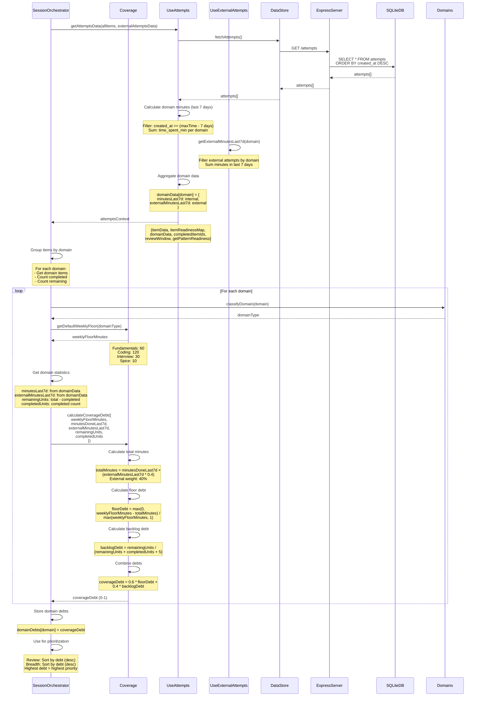

# Coverage Debt Calculation Sequence Diagram

Flow showing coverage debt computation, domain data aggregation, and prioritization usage.

## Flow Details

### Attempts Data Loading
- **Source**: SQLite database (attempts table)
- **Filtering**: All attempts (no time filter at fetch)
- **Ordering**: By `created_at` DESC (most recent first)

### Domain Minutes Calculation
- **Time Window**: Last 7 days from most recent attempt
- **Calculation**: Sum of `time_spent_min` per domain
- **Filtering**: `created_at >= (maxAttemptTime - 7 days)`
- **Result**: `minutesLast7d` per domain

### External Minutes Integration
- **Source**: External attempts (logged separately)
- **Calculation**: Sum of minutes per domain in last 7 days
- **Weight**: 40% contribution to total minutes
- **Formula**: `totalMinutes = minutesLast7d + (externalMinutesLast7d * 0.4)`

### Weekly Floor Defaults
- **Fundamentals**: 60 minutes/week
- **Coding**: 120 minutes/week
- **Interview**: 30 minutes/week
- **Spice**: 10 minutes/week

### Floor Debt Calculation
- **Formula**: `floorDebt = max(0, weeklyFloorMinutes - totalMinutes) / max(weeklyFloorMinutes, 1)`
- **Range**: 0-1 (0 = no debt, 1 = maximum debt)
- **Meaning**: Percentage of weekly floor not met
- **Edge Case**: Division by zero protection (max(weeklyFloorMinutes, 1))

### Backlog Debt Calculation
- **Formula**: `backlogDebt = remainingUnits / (remainingUnits + completedUnits + 5)`
- **Range**: 0-1 (approaches 1 as remaining increases)
- **Meaning**: Proportion of incomplete work
- **Smoothing**: +5 prevents division issues and provides smoothing

### Coverage Debt Combination
- **Formula**: `coverageDebt = 0.6 * floorDebt + 0.4 * backlogDebt`
- **Weights**: 60% floor debt, 40% backlog debt
- **Range**: 0-1 (higher = more debt)
- **Invariant**: Formula unchanged, no time-based factors

### Usage in Prioritization
- **Review Unit**: Secondary sort by coverage debt (after attempt index)
- **Breadth Unit**: Primary sort by coverage debt (descending)
- **Purpose**: Ensures domains with highest debt get attention

## Domain Statistics

### Completed Units
- **Source**: Items with `completed: true` or in `completedItemIds`
- **Calculation**: Count of completed items per domain
- **Use**: Denominator in backlog debt

### Remaining Units
- **Calculation**: `totalItems - completedItems`
- **Use**: Numerator in backlog debt
- **Meaning**: Work still to be done

## External Attempts Integration

### Purpose
- Track practice done outside platform (LeetCode, etc.)
- Contribute to coverage calculation
- Prevent double-counting (40% weight)

### Weight Rationale
- **40% Weight**: External attempts are less structured
- **Balance**: Acknowledges external practice without over-weighting
- **Formula**: `totalMinutes = internal + (external * 0.4)`

## Invariants

- ✅ **Formula Unchanged**: Coverage debt formula never modified
- ✅ **No Time Factors**: No dates, cooldowns, or time-based logic
- ✅ **Deterministic**: Same inputs → same debt scores
- ✅ **External Weight**: External attempts contribute 40% max
- ✅ **Domain-Specific**: Each domain calculated independently

## Error Handling

- **No Attempts**: Returns default debt (0.5 if no data)
- **No Items**: Returns 0 debt (nothing to cover)
- **Division by Zero**: Protected by max(weeklyFloorMinutes, 1)
- **Missing Domain Data**: Uses 0 for missing values

