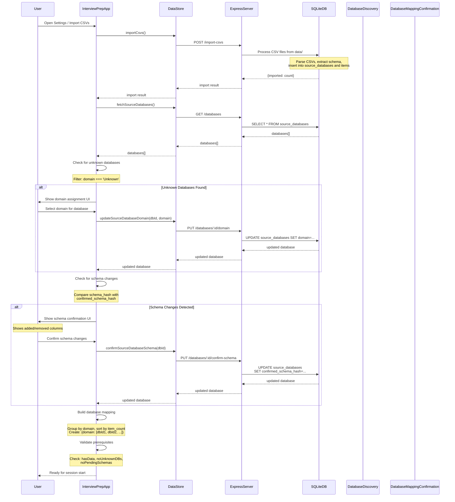

# Database Discovery Flow Sequence Diagram

Flow showing automatic database discovery, classification, and mapping confirmation.

## Flow Details

### CSV Import Process
1. **File Reading**: Reads all CSV files from `data/` directory
2. **Schema Extraction**: Analyzes CSV headers to detect schema
3. **Database Creation**: Creates `source_databases` records
4. **Item Import**: Inserts items into `items` table
5. **Schema Snapshot**: Stores schema as JSON snapshot
6. **Hash Generation**: Creates `schema_hash` for change detection

### Database Discovery
- **Source**: Local SQLite database (not Notion API)
- **Process**: Databases imported from CSV files
- **Metadata**: Title, domain, item_count, schema_hash, confirmed_schema_hash

### Domain Assignment
- **Unknown Detection**: Databases with `domain === 'Unknown'`
- **User Action**: Manual domain selection from domain options
- **Validation**: Domain must match known domains (DSA, OOP, OS, etc.)
- **Update**: Updates database record with selected domain

### Schema Change Detection
- **Comparison**: `schema_hash !== confirmed_schema_hash`
- **Detection**: Automatic on database fetch
- **UI**: Shows added/removed columns
- **Confirmation**: User must explicitly confirm schema changes
- **Blocking**: Blocks session start until confirmed

### Database Mapping Building
- **Grouping**: Groups databases by domain
- **Sorting**: Sorts by item_count (desc) > database ID (asc)
- **Structure**: `{domain: [dbId1, dbId2, ...]}`
- **Support**: Multiple databases per domain (arrays)

### Prerequisites Validation
- **hasData**: At least one database with assigned domain
- **noUnknownDBs**: All databases have domains assigned
- **noPendingSchemas**: All schema changes confirmed
- **Blocking**: Blocks session start if any prerequisite fails

## Schema Fingerprinting

### Hash Generation
- **Input**: Property IDs + types + CPRD presence
- **Process**: Sorted before hashing (order-independent)
- **Storage**: `schema_hash` in database record

### Change Detection
- **Trigger**: `schema_hash !== confirmed_schema_hash`
- **Action**: Shows confirmation UI
- **Blocking**: Blocks orchestration until confirmed
- **Confirmation**: Updates `confirmed_schema_hash`

## Zero-Trust Pattern

- **Domain Assignment**: User must explicitly select domain
- **Schema Confirmation**: User must explicitly confirm schema changes
- **No Auto-Decision**: Never auto-assigns domains or confirms schemas
- **Always Show**: Always displays what will change before applying

## Error Handling

- **Import Failure**: Shows error message, allows retry
- **Invalid Domain**: Shows error, blocks assignment
- **Schema Mismatch**: Shows diff, requires confirmation
- **Database Not Found**: Shows error, allows refresh

## Invariants

- ✅ **Deterministic Mapping**: Same databases → same mapping order
- ✅ **Schema Fingerprinting**: Detects all schema changes
- ✅ **Zero-Trust**: Never auto-assigns or auto-confirms
- ✅ **Multi-Database Support**: Handles multiple databases per domain

