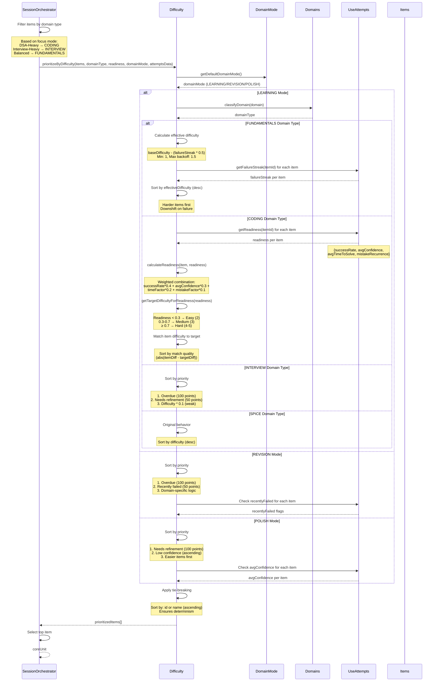

# Difficulty Prioritization Flow Sequence Diagram

Flow showing multi-factor difficulty-based item prioritization with domain mode and type branching.

## Flow Details

### Domain Mode Branching (First)
- **LEARNING**: Default mode, domain-specific logic
- **REVISION**: Prioritizes overdue and recently failed
- **POLISH**: Prioritizes refinement and confidence building

### Domain Type Branching (Second)
- **FUNDAMENTALS**: Hard-first with failure backoff
- **CODING**: Readiness-based difficulty matching
- **INTERVIEW**: Overdue/refinement prioritized
- **SPICE**: Original behavior (low frequency)

### LEARNING Mode - Fundamentals
- **Effective Difficulty**: `baseDifficulty - min(1.5, failureStreak * 0.5)`
- **Failure Streak**: Attempt-based only (no time logic)
- **Sorting**: Descending (harder first)
- **Downshift**: Automatic on repeated failure

### LEARNING Mode - Coding
- **Readiness Calculation**:
  - `successRate * 0.4`
  - `avgConfidence * 0.3`
  - `timeFactor * 0.2` (1 - time/60, max 1)
  - `mistakeFactor * 0.1` (1 - mistakeRecurrence)
- **Target Difficulty**:
  - Readiness < 0.3 → Easy (2)
  - Readiness 0.3-0.7 → Medium (3)
  - Readiness ≥ 0.7 → Hard (4-5)
- **Matching**: Selects items where difficulty matches target readiness
- **Pattern Readiness**: Uses pattern-level readiness if available

### LEARNING Mode - Interview
- **Priority Order**:
  1. Overdue items (100 points)
  2. Needs refinement (50 points)
  3. Difficulty * 0.1 (weak weighting)
- **Overdue**: `lastAttemptIndex >= OVERDUE_ATTEMPT_GAP` (15)
- **Refinement**: `lastResult === 'Stuck' || avgConfidence < 0.5`

### REVISION Mode
- **Priority Order**:
  1. Overdue items (100 points)
  2. Recently failed (50 points)
  3. Domain-specific secondary sort
- **Recently Failed**: `lastResult === 'Stuck' || lastResult === 'Skipped'`
- **Secondary**: Coding uses readiness, others use difficulty

### POLISH Mode
- **Priority Order**:
  1. Needs refinement (100 points)
  2. Low confidence (ascending sort)
  3. Easier items first (ascending difficulty)
- **Refinement**: Same as Interview mode
- **Confidence**: Lower confidence = higher priority

### Tie-Breaking
- **Deterministic**: Sort by `id` or `name` (ascending)
- **Purpose**: Ensures same inputs → same outputs
- **Applied**: After all priority sorting

## Readiness Metrics

### Calculation
- **Success Rate**: `solved.length / recent.length` (last 10 attempts)
- **Avg Confidence**: Average of confidence values (High=1, Medium=0.5, Low=0)
- **Avg Time**: Average of `time_spent_min` values
- **Mistake Recurrence**: `mistakes.length / recent.length`

### Pattern-Level Readiness
- **Aggregation**: Averages readiness across all items with same pattern
- **Use Case**: Coding domains (DSA, OA)
- **Benefit**: Better difficulty selection for pattern-based learning

## Failure Streak

### Calculation
- **Attempt-Based Only**: No time logic
- **Increment**: On 'Stuck' or 'Skipped' results
- **Reset**: On 'Solved' or 'Partial' results (streak = 0)
- **Max Backoff**: 1.5 difficulty reduction

## Invariants

- ✅ **Mode First**: Domain mode branches before domain type
- ✅ **Attempt-Based**: Failure backoff uses attempt streak only
- ✅ **Deterministic**: Tie-breaking ensures same outputs
- ✅ **Readiness-Based**: Coding domains use readiness, not absolute difficulty
- ✅ **No Time Logic**: No dates, cooldowns, or resurfacing windows

