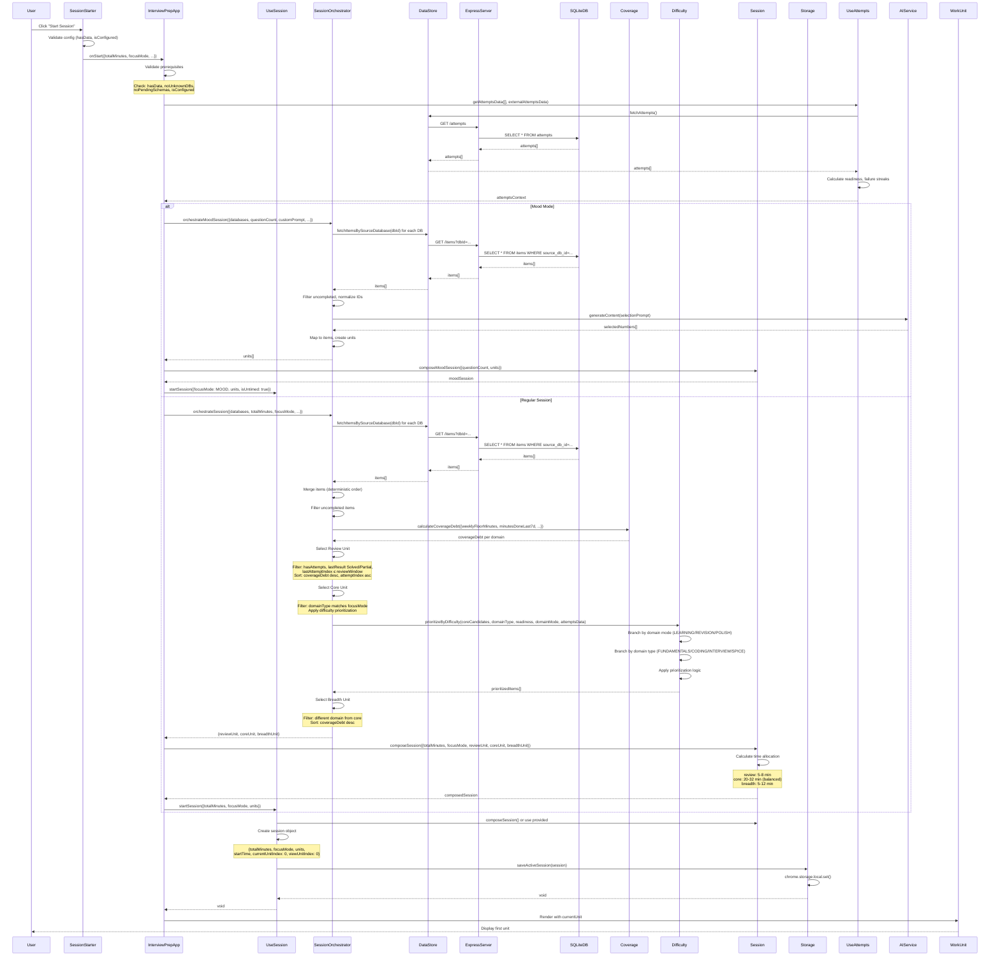

# Session Start Flow Sequence Diagram

Complete flow from user action to session start, showing all interactions.



## Flow Details

### Prerequisites Validation
1. **hasData**: Database mapping exists
2. **noUnknownDBs**: All databases have assigned domains
3. **noPendingSchemas**: Schema changes confirmed
4. **isConfigured**: AI service configured (Gemini key or Ollama)

### Attempts Data Loading
- Loads all attempts from database
- Calculates readiness metrics per item
- Calculates failure streaks
- Aggregates domain-level statistics
- Returns comprehensive attempts context

### Mood Mode Flow
- Fetches items from all databases
- Uses AI service to select questions based on custom prompt
- Creates N units (5 or 10) from selected items
- Composes untimed mood session

### Regular Session Flow
1. **Item Fetching**: Parallel fetch from all databases
2. **Coverage Debt**: Calculated per domain
3. **Review Selection**: Recently completed items
4. **Core Selection**: Based on focus mode and difficulty prioritization
5. **Breadth Selection**: Highest coverage debt, different domain
6. **Composition**: Time allocation and unit validation
7. **Persistence**: Saved to Chrome storage

### Time Allocation
- **Balanced**: Review 5-8, Core 20-32, Breadth 5-12
- **DSA-Heavy**: Review 5-8, Core 25-35, Breadth 5-10
- **Interview-Heavy**: Review 5-8, Core 18-28, Breadth 8-15
- **Total**: Always matches selected duration (30, 45, or 90 minutes)

### Session Object Structure
```javascript
{
  totalMinutes: 45,
  focusMode: 'balanced',
  units: [
    { type: 'review', timeMinutes: 6, unitType: '...', item: {...}, rationale: '...' },
    { type: 'core', timeMinutes: 28, unitType: '...', item: {...}, rationale: '...' },
    { type: 'breadth', timeMinutes: 11, unitType: '...', item: {...}, rationale: '...' }
  ],
  startTime: 1234567890,
  currentUnitIndex: 0,
  viewUnitIndex: 0
}
```

## Error Handling

- **No Data**: Shows error, blocks session start
- **Unknown Databases**: Shows error with count, blocks session start
- **Pending Schemas**: Shows error, blocks session start
- **Not Configured**: Shows error with setup instructions
- **Orchestration Failure**: Shows error message, allows retry

## Invariants

- ✅ **Exactly 3 Units**: Regular sessions always have Review, Core, Breadth
- ✅ **Deterministic**: Same inputs → same unit selection
- ✅ **Time Allocation**: Total always matches selected duration
- ✅ **Session Persistence**: Saved to Chrome storage for recovery

