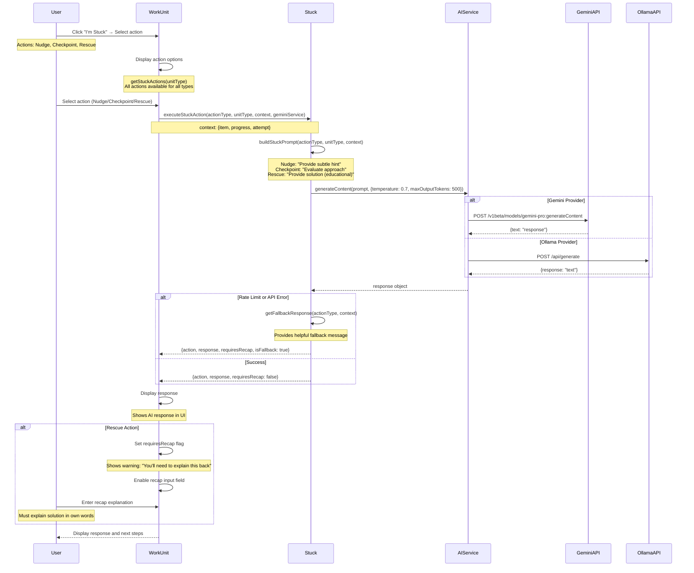

# Stuck Mode Flow Sequence Diagram

Flow showing stuck action execution, AI service interaction, and response handling.



## Flow Details

### Stuck Actions
- **NUDGE**: Subtle hint (1-2 sentences) without revealing solution
- **CHECKPOINT**: Evaluates current approach (2-3 sentences feedback)
- **RESCUE**: Full solution explanation (educational, structured) - requires recap

### Action Availability
- **All Actions**: Available for all unit types
- **No Restrictions**: SolveProblem, ConceptBite, RecallCheck, etc. all support all actions

### Prompt Building
- **Context**: Includes item name, current progress, attempt details
- **Action-Specific**:
  - **Nudge**: "Provide a subtle nudge (1-2 sentences) that guides thinking without revealing the solution"
  - **Checkpoint**: "Evaluate if their current approach is on the right track. Provide brief feedback (2-3 sentences)"
  - **Rescue**: "Provide a clear explanation of the solution. The user will need to explain it back, so make it educational and structured"

### AI Service Integration
- **Provider Selection**: Based on user profile (Gemini or Ollama)
- **Configuration**:
  - Temperature: 0.7 (balanced creativity)
  - Max Output Tokens: 500 (concise responses)
- **Error Handling**: Rate limit detection with fallback responses

### Fallback Responses
- **Trigger**: Rate limit (429) or API error
- **Content**: Helpful generic guidance
- **Format**: Same structure as AI response
- **Flag**: `isFallback: true` for UI indication

### Rescue Mode Requirements
- **Flag**: `requiresRecap: true`
- **UI Warning**: "⚠️ You'll need to explain this back to complete the unit"
- **Validation**: Recap must be non-empty before unit completion
- **Purpose**: Ensures user understands solution, not just copying

### Response Structure
```javascript
{
  action: 'nudge' | 'checkpoint' | 'rescue',
  response: "AI-generated response text",
  requiresRecap: boolean, // true only for rescue
  isFallback: boolean // true if fallback used
}
```

## Error Handling

- **Rate Limiting**: Detects 429 errors, provides fallback
- **API Errors**: Catches exceptions, provides fallback
- **Network Errors**: Shows error message, allows retry
- **Never Silent**: Always provides some response (AI or fallback)

## Invariants

- ✅ **All Actions Available**: Every unit type supports all stuck actions
- ✅ **Rescue Requires Recap**: Rescue action always requires recap explanation
- ✅ **Fallback Available**: Always provides response (AI or fallback)
- ✅ **No Direct Mutation**: Stuck mode provides guidance only, doesn't mutate user data

