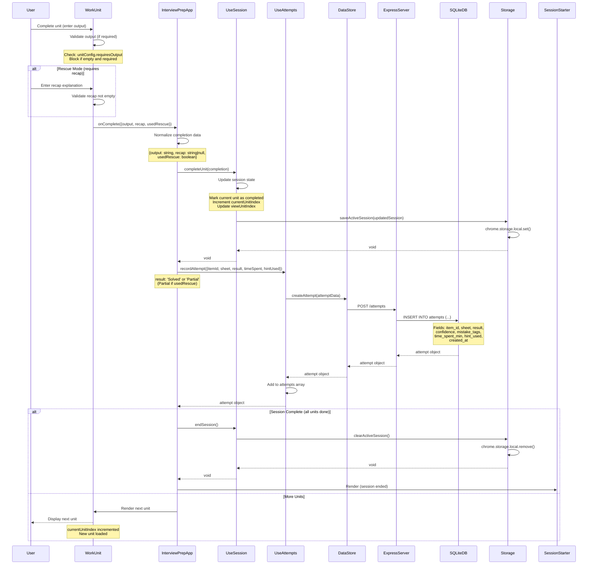

# Unit Completion Flow Sequence Diagram

Flow showing unit completion, attempt recording, and session progression.



## Flow Details

### Output Validation
- **Required Output**: All unit types require output (`requiresOutput: true`)
- **Validation**: Blocks completion if output is empty
- **Rescue Mode**: Requires both solution and recap explanation

### Completion Data Structure
```javascript
{
  output: "User's solution/answer",
  recap: "Explanation of solution (if rescue mode)",
  usedRescue: false // true if rescue was used
}
```

### Attempt Recording
- **System-Owned Data**: No confirmation required
- **Result Mapping**:
  - Normal completion → `'Solved'`
  - Rescue used → `'Partial'`
- **Fields Recorded**:
  - `item_id`: Item identifier
  - `sheet`: Domain name
  - `result`: 'Solved' or 'Partial'
  - `time_spent_min`: Time spent (from unit.timeMinutes)
  - `hint_used`: Boolean (true if rescue used)
  - `confidence`: Optional (not set in this flow)
  - `mistake_tags`: Optional (not set in this flow)
  - `created_at`: Auto-generated timestamp

### Session State Update
- **Current Unit**: Marked as `completed: true` with `output`
- **Current Unit Index**: Incremented to next unit
- **View Unit Index**: Updated to match current unit
- **Persistence**: Saved to Chrome storage immediately

### Session Completion
- **Check**: `currentUnitIndex >= units.length`
- **Action**: Clear session from storage
- **UI**: Return to SessionStarter view

### Error Handling
- **Validation Failure**: Shows error, blocks completion
- **API Failure**: Shows error, allows retry
- **Storage Failure**: Logs error, continues (session in memory)

## Invariants

- ✅ **Output Required**: All units require output for completion
- ✅ **Rescue Recap**: Rescue mode requires recap explanation
- ✅ **Attempt Recording**: Every completion creates an attempt record
- ✅ **Session Progression**: Sequential unit completion (no skipping)
- ✅ **State Persistence**: Session state saved after each completion

