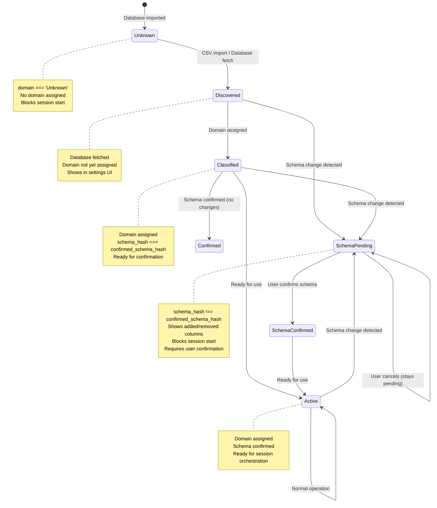

# Database Mapping State Machine

State transitions for database discovery, classification, and confirmation.



## State Descriptions

### Unknown
- **Description**: Database imported but domain not assigned
- **Condition**: `domain === 'Unknown'`
- **UI**: Shows in settings with domain assignment UI
- **Blocking**: Blocks session start
- **Action**: User must assign domain

### Discovered
- **Description**: Database fetched from storage
- **Condition**: Database exists but domain not assigned
- **UI**: Shows in settings
- **Transition**: User assigns domain → Classified

### Classified
- **Description**: Domain assigned, schema matches
- **Condition**: 
  - `domain !== 'Unknown'`
  - `schema_hash === confirmed_schema_hash`
- **UI**: Shows in database list
- **Transition**: 
  - Schema change detected → SchemaPending
  - No changes → Confirmed → Active

### SchemaPending
- **Description**: Schema changes detected, awaiting confirmation
- **Condition**: `schema_hash !== confirmed_schema_hash`
- **UI**: Shows schema diff (added/removed columns)
- **Blocking**: Blocks session start
- **Action**: User must confirm schema changes
- **Transition**: 
  - User confirms → SchemaConfirmed
  - User cancels → Stays pending

### SchemaConfirmed
- **Description**: Schema changes confirmed by user
- **Condition**: `confirmed_schema_hash === schema_hash`
- **Process**: Updates `confirmed_schema_hash` in database
- **Transition**: Active

### Active
- **Description**: Database ready for use
- **Condition**: 
  - `domain !== 'Unknown'`
  - `schema_hash === confirmed_schema_hash`
- **UI**: Included in database mapping
- **Usage**: Available for session orchestration
- **Transition**: Schema change detected → SchemaPending

## State Data Structure

### Database Object
```javascript
{
  id: 'database-id',
  title: 'DSA Problems',
  domain: 'DSA' | 'Unknown',
  item_count: 150,
  schema_hash: 'abc123...',
  confirmed_schema_hash: 'abc123...',
  schema_snapshot: '["Name", "Difficulty", ...]',
  confirmed_schema_snapshot: '["Name", "Difficulty", ...]'
}
```

### State Detection
- **Unknown**: `domain === 'Unknown'`
- **SchemaPending**: `schema_hash !== confirmed_schema_hash`
- **Active**: `domain !== 'Unknown' && schema_hash === confirmed_schema_hash`

## Transitions

### Unknown → Discovered
- **Trigger**: Database fetched from storage
- **Action**: None (automatic)

### Discovered → Classified
- **Trigger**: User assigns domain
- **Action**: `updateSourceDatabaseDomain(dbId, domain)`
- **Update**: Sets `domain` field

### Classified → SchemaPending
- **Trigger**: Schema change detected
- **Detection**: `schema_hash !== confirmed_schema_hash`
- **Action**: Shows schema confirmation UI

### SchemaPending → SchemaConfirmed
- **Trigger**: User confirms schema changes
- **Action**: `confirmSourceDatabaseSchema(dbId)`
- **Update**: Sets `confirmed_schema_hash = schema_hash`

### SchemaConfirmed → Active
- **Trigger**: Schema confirmed
- **Action**: Automatic transition
- **Result**: Database ready for use

### Active → SchemaPending
- **Trigger**: Schema change detected (re-import, etc.)
- **Detection**: `schema_hash !== confirmed_schema_hash`
- **Action**: Shows schema confirmation UI again

## Schema Fingerprinting

### Hash Generation
- **Input**: Property IDs + types + CPRD presence
- **Process**: Sorted before hashing (order-independent)
- **Storage**: `schema_hash` in database record

### Change Detection
- **Comparison**: `schema_hash !== confirmed_schema_hash`
- **Trigger**: Automatic on database fetch
- **Action**: Shows confirmation UI

## Zero-Trust Pattern

### Domain Assignment
- **Never Auto-Assign**: User must explicitly select domain
- **Validation**: Domain must match known domains
- **Confirmation**: No implicit acceptance

### Schema Confirmation
- **Never Auto-Confirm**: User must explicitly confirm
- **Display**: Shows exact changes (added/removed columns)
- **Blocking**: Blocks session start until confirmed

## Prerequisites for Session Start

### All Databases Must Be:
1. **Classified**: `domain !== 'Unknown'`
2. **Schema Confirmed**: `schema_hash === confirmed_schema_hash`
3. **Active**: Ready for orchestration

### Validation
- **Check**: All databases in Active state
- **Block**: Session start blocked if any database not Active
- **Error**: Shows specific error message

## Error Handling

### Invalid Domain
- **Trigger**: Domain doesn't match known domains
- **State**: Stays in Discovered
- **UI**: Shows error message
- **Action**: User must select valid domain

### Schema Confirmation Failure
- **Trigger**: API error during confirmation
- **State**: Stays in SchemaPending
- **UI**: Shows error message
- **Action**: User can retry

## Invariants

- ✅ **Zero-Trust**: Never auto-assigns domains or confirms schemas
- ✅ **Schema Fingerprinting**: Detects all schema changes
- ✅ **Blocking**: Blocks session start until all prerequisites met
- ✅ **Deterministic**: Same schema → same hash
- ✅ **Recovery**: Can recover from any state with user action

