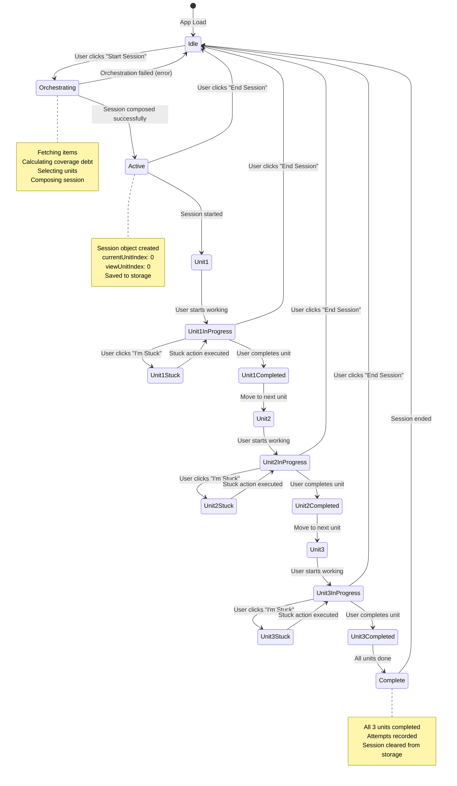

# Session State Machine

State transitions for session lifecycle from idle to completion.



## State Descriptions

### Idle
- **Description**: No active session
- **UI**: Shows SessionStarter component
- **Actions**: User can start new session
- **Storage**: No active session in storage

### Orchestrating
- **Description**: Session composition in progress
- **UI**: Shows loading spinner "Composing your session..."
- **Process**:
  - Fetching items from databases
  - Calculating coverage debt
  - Selecting review, core, breadth units
  - Composing session
- **Transitions**: 
  - Success → Active
  - Failure → Idle (with error)

### Active
- **Description**: Session created, ready to start
- **UI**: Shows WorkUnit with first unit
- **State**: `currentUnitIndex: 0`, `viewUnitIndex: 0`
- **Storage**: Session saved to Chrome storage
- **Actions**: User can start first unit or end session

### Unit States (1, 2, 3)
Each unit follows the same state pattern:

#### UnitN
- **Description**: Unit loaded, not yet started
- **UI**: Shows unit content, output field
- **Actions**: User can start working or navigate

#### UnitNInProgress
- **Description**: User actively working on unit
- **UI**: Shows unit content, output field (editable)
- **Actions**: 
  - Complete unit (with output)
  - Get stuck help
  - Navigate to other units (view-only)

#### UnitNStuck
- **Description**: User requested stuck help
- **UI**: Shows stuck action options or response
- **Actions**:
  - Select stuck action (Nudge, Checkpoint, Rescue)
  - View AI response
  - Continue working (if not rescue)
  - Enter recap (if rescue)

#### UnitNCompleted
- **Description**: Unit completed with output
- **UI**: Shows completed unit with output
- **Process**:
  - Attempt recorded
  - Session state updated
  - Storage updated
- **Transition**: Automatically moves to next unit

### Complete
- **Description**: All 3 units completed
- **UI**: Returns to SessionStarter
- **Process**:
  - All attempts recorded
  - Session cleared from storage
- **Transition**: Automatically returns to Idle

## State Data Structure

### Session Object
```javascript
{
  totalMinutes: 45,
  focusMode: 'balanced',
  units: [
    { type: 'review', completed: false, output: null, ... },
    { type: 'core', completed: false, output: null, ... },
    { type: 'breadth', completed: false, output: null, ... }
  ],
  startTime: 1234567890,
  currentUnitIndex: 0,  // Unit being edited
  viewUnitIndex: 0      // Unit being viewed
}
```

### State Transitions
- **currentUnitIndex**: Increments on unit completion
- **viewUnitIndex**: Can be set independently for navigation
- **units[].completed**: Set to true on completion
- **units[].output**: Set on completion

## Navigation States

### View vs Edit
- **currentUnitIndex**: Unit that can be edited/completed
- **viewUnitIndex**: Unit currently displayed (can be any unit)
- **Restriction**: Can only complete unit at `currentUnitIndex`
- **Navigation**: Can view all units, but editing restricted

### Unit Navigation
- **Previous**: `viewUnitIndex > 0` → decrement
- **Next**: `viewUnitIndex < units.length - 1` → increment
- **Purpose**: Review completed units or preview upcoming units

## Error States

### Orchestration Failure
- **Trigger**: Error during session composition
- **State**: Returns to Idle
- **UI**: Shows error message
- **Action**: User can retry

### Validation Failure
- **Trigger**: Missing prerequisites (no data, unknown DBs, etc.)
- **State**: Stays in Idle
- **UI**: Shows error message
- **Action**: User must fix prerequisites

## Invariants

- ✅ **Exactly 3 Units**: Session always has Review, Core, Breadth
- ✅ **Sequential Completion**: Units completed in order (0, 1, 2)
- ✅ **State Persistence**: Session state saved after each transition
- ✅ **No Skipping**: Cannot complete unit N+1 before unit N
- ✅ **Recovery**: Session can be recovered from storage on app reload

