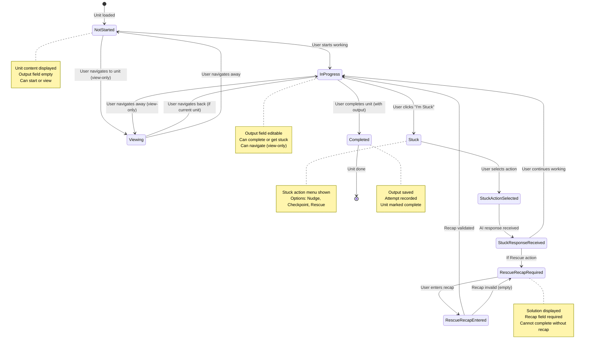

# Unit State Machine

State transitions for individual work unit progression.



## State Descriptions

### NotStarted
- **Description**: Unit loaded but not yet started
- **UI**: Shows unit content, empty output field
- **Actions**: 
  - Start working (enter InProgress)
  - View unit (enter Viewing, if not current unit)
- **Context**: Can be current unit or viewed unit

### InProgress
- **Description**: User actively working on unit
- **UI**: Shows unit content, editable output field
- **Actions**:
  - Complete unit (requires output)
  - Get stuck help
  - Navigate to other units (view-only)
- **Validation**: Output required for completion
- **Context**: Only current unit can be in this state

### Stuck
- **Description**: User requested stuck help
- **UI**: Shows stuck action options
- **Actions**: 
  - Select Nudge (hint)
  - Select Checkpoint (approach validation)
  - Select Rescue (full solution, requires recap)
- **Transitions**: 
  - Action selected → StuckActionSelected
  - Cancel → InProgress

### StuckActionSelected
- **Description**: Stuck action chosen, waiting for AI response
- **UI**: Shows loading state
- **Process**: AI service generating response
- **Transitions**: 
  - Response received → StuckResponseReceived
  - Error → InProgress (with fallback)

### StuckResponseReceived
- **Description**: AI response received and displayed
- **UI**: Shows AI response
- **Actions**:
  - Continue working (if Nudge/Checkpoint)
  - Enter recap (if Rescue)
- **Transitions**:
  - Continue → InProgress
  - Rescue → RescueRecapRequired

### RescueRecapRequired
- **Description**: Rescue action used, recap required
- **UI**: Shows solution, recap input field
- **Validation**: Recap must be non-empty
- **Actions**:
  - Enter recap explanation
  - Complete unit (only if recap provided)
- **Transitions**:
  - Recap entered → RescueRecapEntered
  - Complete (no recap) → Stuck (validation error)

### RescueRecapEntered
- **Description**: Recap entered, validating
- **Validation**: Recap must be non-empty
- **Transitions**:
  - Valid → InProgress (can now complete)
  - Invalid → RescueRecapRequired (error shown)

### Viewing
- **Description**: Unit being viewed (not edited)
- **UI**: Shows unit content, read-only output (if completed)
- **Context**: Can view any unit, but only current unit can be edited
- **Actions**:
  - Navigate to other units
  - Return to current unit (if viewing current)
- **Transitions**:
  - Navigate to current → InProgress (if current unit)
  - Navigate away → NotStarted or Viewing

### Completed
- **Description**: Unit completed with output
- **UI**: Shows unit content and saved output
- **Process**:
  - Output saved to session
  - Attempt recorded
  - Unit marked complete
- **Transitions**: Automatically moves to next unit (or session complete)

## State Data Structure

### Unit Object
```javascript
{
  type: 'review' | 'core' | 'breadth',
  unitType: 'SolveProblem' | 'ConceptBite' | ...,
  item: { id, name, domain, ... },
  rationale: 'Reviewing DSA to reinforce learning',
  timeMinutes: 6,
  completed: false,
  output: null,
  recap: null,
  usedRescue: false
}
```

### Completion Data
```javascript
{
  output: "User's solution/answer",
  recap: "Explanation (if rescue)",
  usedRescue: false
}
```

## Stuck Action States

### Nudge
- **Response**: Subtle hint (1-2 sentences)
- **Requires Recap**: No
- **Transition**: Direct to InProgress

### Checkpoint
- **Response**: Approach validation (2-3 sentences)
- **Requires Recap**: No
- **Transition**: Direct to InProgress

### Rescue
- **Response**: Full solution explanation
- **Requires Recap**: Yes (mandatory)
- **Transition**: RescueRecapRequired → RescueRecapEntered → InProgress

## Validation Rules

### Output Validation
- **Required**: All unit types require output
- **Check**: `unitConfig.requiresOutput === true`
- **Block**: Completion blocked if output empty

### Recap Validation
- **Required**: Only for Rescue action
- **Check**: Recap must be non-empty string
- **Block**: Completion blocked if recap empty

## Navigation States

### Current Unit
- **State**: Can be InProgress (editable)
- **Restriction**: Only current unit can be completed
- **Navigation**: Can view other units, but editing restricted

### Viewed Unit
- **State**: Can be NotStarted, Viewing, or Completed
- **Restriction**: Read-only (cannot edit or complete)
- **Navigation**: Free navigation between all units

## Error States

### Validation Error
- **Trigger**: Attempt to complete without output or recap
- **State**: Stays in current state
- **UI**: Shows error message
- **Action**: User must provide required input

### AI Service Error
- **Trigger**: Rate limit or API error
- **State**: StuckResponseReceived (with fallback)
- **UI**: Shows fallback response
- **Flag**: `isFallback: true`

## Invariants

- ✅ **Output Required**: All units require output for completion
- ✅ **Rescue Recap**: Rescue action always requires recap
- ✅ **Sequential Completion**: Units completed in order
- ✅ **State Persistence**: Unit state saved in session
- ✅ **No Skipping**: Cannot complete unit without output

