# User Use Case Diagram

All user-facing features and interactions with the system.

```mermaid
graph TB
    User((User))
    
    subgraph "Authentication"
        UC_SignIn[Sign In with Google]
        UC_SignOut[Sign Out]
    end
    
    subgraph "Session Management"
        UC_StartSession[Start Session]
        UC_StartMoodSession[Start Mood Session]
        UC_CompleteUnit[Complete Unit]
        UC_EndSession[End Session]
        UC_NavigateUnits[Navigate Between Units]
    end
    
    subgraph "Learning Support"
        UC_GetStuckHelp[Get Stuck Help]
        UC_ViewResources[View Problem Resources]
        UC_UseRealtimeAI[Use Real-time AI Features]
    end
    
    subgraph "Progress Tracking"
        UC_ViewProgress[View Progress]
        UC_ViewDetails[View Domain Details]
        UC_LogExternal[Log External Progress]
    end
    
    subgraph "Configuration"
        UC_ConfigureAI[Configure AI Provider]
        UC_ImportData[Import CSV Data]
        UC_AssignDomains[Assign Database Domains]
        UC_ConfirmSchema[Confirm Schema Changes]
        UC_ResetProgress[Reset Domain Progress]
    end
    
    subgraph "Analysis"
        UC_DeepImprove[Deep Improve Analysis]
    end
    
    User --> UC_SignIn
    User --> UC_SignOut
    
    User --> UC_StartSession
    User --> UC_StartMoodSession
    User --> UC_CompleteUnit
    User --> UC_EndSession
    User --> UC_NavigateUnits
    
    User --> UC_GetStuckHelp
    User --> UC_ViewResources
    User --> UC_UseRealtimeAI
    
    User --> UC_ViewProgress
    User --> UC_ViewDetails
    User --> UC_LogExternal
    
    User --> UC_ConfigureAI
    User --> UC_ImportData
    User --> UC_AssignDomains
    User --> UC_ConfirmSchema
    User --> UC_ResetProgress
    
    User --> UC_DeepImprove
    
    style User fill:#4a90e2
    style UC_StartSession fill:#50c878
    style UC_CompleteUnit fill:#50c878
    style UC_GetStuckHelp fill:#ffa500
    style UC_ViewProgress fill:#9b59b6
    style UC_ConfigureAI fill:#e74c3c
```

## Use Case Descriptions

### Authentication

#### Sign In with Google
- **Actor**: User
- **Precondition**: Not authenticated
- **Main Flow**:
  1. User clicks "Sign In with Google"
  2. Google OAuth flow initiated
  3. User authenticates with Google
  4. Token exchanged with backend
  5. User profile loaded
  6. User authenticated
- **Postcondition**: User signed in, profile loaded
- **Extensions**: Authentication failure → Show error

#### Sign Out
- **Actor**: User
- **Precondition**: Authenticated
- **Main Flow**:
  1. User clicks "Sign Out"
  2. Session cleared
  3. Token removed
  4. User signed out
- **Postcondition**: User signed out, redirected to sign-in

### Session Management

#### Start Session
- **Actor**: User
- **Precondition**: Authenticated, data imported, domains assigned, schemas confirmed
- **Main Flow**:
  1. User selects duration (30, 45, or 90 minutes)
  2. User selects focus mode (Balanced, DSA-Heavy, Interview-Heavy)
  3. User clicks "Start Session"
  4. System orchestrates session (fetches items, calculates coverage debt, selects units)
  5. System composes 3-unit session
  6. Session started
  7. First unit displayed
- **Postcondition**: Active session with 3 units
- **Extensions**: 
  - No data → Show error
  - Unknown databases → Show error
  - Pending schemas → Show error
  - Not configured → Show error

#### Start Mood Session
- **Actor**: User
- **Precondition**: Authenticated, data imported
- **Main Flow**:
  1. User selects "Mood" mode
  2. User enters custom prompt
  3. User selects question count (5 or 10)
  4. User clicks "Start Session"
  5. System uses AI to select questions based on prompt
  6. System creates untimed session with N units
  7. Session started
- **Postcondition**: Active untimed mood session
- **Extensions**: AI selection failure → Fallback keyword matching

#### Complete Unit
- **Actor**: User
- **Precondition**: Active session, unit in progress
- **Main Flow**:
  1. User enters output (required)
  2. If rescue used, user enters recap (required)
  3. User clicks "Complete"
  4. System validates output (and recap if rescue)
  5. System records attempt
  6. System moves to next unit
  7. If all units done, session ends
- **Postcondition**: Unit completed, attempt recorded, next unit or session ended
- **Extensions**: 
  - No output → Show error
  - No recap (rescue) → Show error

#### End Session
- **Actor**: User
- **Precondition**: Active session
- **Main Flow**:
  1. User clicks "End Session"
  2. System clears session from storage
  3. Session ended
  4. Returns to SessionStarter
- **Postcondition**: Session ended, no active session

#### Navigate Between Units
- **Actor**: User
- **Precondition**: Active session
- **Main Flow**:
  1. User clicks previous/next navigation
  2. System updates viewUnitIndex
  3. System displays selected unit (view-only)
  4. User can view any unit, but only current unit editable
- **Postcondition**: Different unit viewed
- **Extensions**: Cannot navigate beyond unit bounds

### Learning Support

#### Get Stuck Help
- **Actor**: User
- **Precondition**: Unit in progress
- **Main Flow**:
  1. User clicks "I'm Stuck"
  2. System shows stuck action options (Nudge, Checkpoint, Rescue)
  3. User selects action
  4. System calls AI service
  5. System displays response
  6. If rescue, system requires recap
- **Postcondition**: Stuck help provided, user can continue
- **Extensions**: 
  - AI service error → Show fallback response
  - Rate limit → Show fallback response

#### View Problem Resources
- **Actor**: User
- **Precondition**: Unit in progress
- **Main Flow**:
  1. User clicks "View Resources"
  2. System fetches web search results
  3. System fetches documentation links
  4. System displays resources
- **Postcondition**: Resources displayed

#### Use Real-time AI Features
- **Actor**: User
- **Precondition**: Unit in progress
- **Main Flow**:
  1. System provides real-time hints
  2. System assesses difficulty
  3. System recognizes patterns
  4. User views AI insights
- **Postcondition**: AI features active

### Progress Tracking

#### View Progress
- **Actor**: User
- **Precondition**: Authenticated
- **Main Flow**:
  1. User clicks "Progress" button
  2. System loads attempts data
  3. System calculates coverage debt
  4. System displays progress overview
  5. User can view domain details
- **Postcondition**: Progress view displayed

#### View Domain Details
- **Actor**: User
- **Precondition**: Progress view open
- **Main Flow**:
  1. User clicks domain in progress view
  2. System loads domain statistics
  3. System displays item-level details
  4. System shows attempt history
- **Postcondition**: Domain details displayed

#### Log External Progress
- **Actor**: User
- **Precondition**: Authenticated
- **Main Flow**:
  1. User opens external progress log
  2. User enters domain, minutes, date
  3. User submits
  4. System records external attempt
  5. System updates coverage debt (40% weight)
- **Postcondition**: External progress logged

### Configuration

#### Configure AI Provider
- **Actor**: User
- **Precondition**: Authenticated
- **Main Flow**:
  1. User opens Settings
  2. User selects AI provider (Gemini or Ollama)
  3. If Gemini, user enters API key
  4. If Ollama, user enters URL and model
  5. User saves settings
  6. System updates profile
- **Postcondition**: AI provider configured

#### Import CSV Data
- **Actor**: User
- **Precondition**: Authenticated
- **Main Flow**:
  1. User places CSV files in `data/` directory
  2. User clicks "Import CSVs"
  3. System processes CSV files
  4. System extracts schema
  5. System imports items
  6. System creates database records
- **Postcondition**: Data imported, databases created

#### Assign Database Domains
- **Actor**: User
- **Precondition**: Databases imported
- **Main Flow**:
  1. System detects unknown databases
  2. User selects domain for each database
  3. User confirms assignment
  4. System updates database domain
- **Postcondition**: All databases have domains assigned
- **Extensions**: Invalid domain → Show error

#### Confirm Schema Changes
- **Actor**: User
- **Precondition**: Schema changes detected
- **Main Flow**:
  1. System detects schema changes
  2. System shows schema diff
  3. User reviews changes
  4. User confirms schema
  5. System updates confirmed_schema_hash
- **Postcondition**: Schema confirmed, ready for use
- **Extensions**: Confirmation failure → Show error

#### Reset Domain Progress
- **Actor**: User
- **Precondition**: Authenticated
- **Main Flow**:
  1. User opens Settings
  2. User selects domain
  3. User clicks "Reset Domain Progress"
  4. User confirms
  5. System marks all domain items as incomplete
  6. Attempts remain unchanged
- **Postcondition**: Domain progress reset

### Analysis

#### Deep Improve Analysis
- **Actor**: User
- **Precondition**: Authenticated, data imported
- **Main Flow**:
  1. User opens Deep Improve
  2. User chats with AI about domain data quality
  3. System analyzes data
  4. System provides improvement suggestions
  5. User views recommendations
- **Postcondition**: Analysis complete, suggestions provided

## Use Case Relationships

### Includes
- **Start Session** includes **Orchestrate Session**
- **Complete Unit** includes **Record Attempt**
- **Get Stuck Help** includes **Call AI Service**

### Extends
- **Start Session** extends **Validate Prerequisites**
- **Complete Unit** extends **Validate Output**
- **Get Stuck Help** extends **Handle AI Error**

### Generalization
- **Start Session** and **Start Mood Session** are specializations of **Start Learning Session**

## Preconditions Summary

### For Session Start
- Authenticated
- Data imported
- All databases have domains assigned
- All schema changes confirmed
- AI provider configured

### For Unit Completion
- Active session
- Unit in progress
- Output provided (required)
- Recap provided (if rescue used)

## Postconditions Summary

### After Session Start
- Active session created
- 3 units composed
- First unit displayed
- Session saved to storage

### After Unit Completion
- Unit marked complete
- Attempt recorded
- Next unit displayed (or session ended)
- Session state updated

